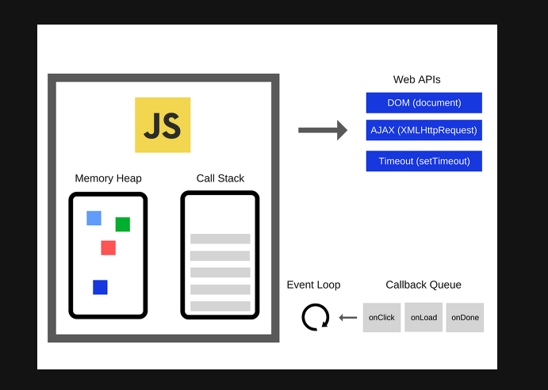

# JS가 싱글스레드임에도 비동기 처리가 가능한 이유

- 자바스크립트의 런타임 모델은 코드의 실행, 이벤트의 수집과 처리, 큐에 대기중인 하위 작업을 처리하는 이벤트 루프를 기반하고 있다.

- Non-blocking I/O와 단일 스레드 이벤트 루프를 통해 높은 처리 성능을 가진다.
- 이벤트 루프는 스레드 이다.
- Memory Heap과 Call Stack 부분은 Javascript Engine

## Stack

- 함수의 호출들은 프레임 스택을 형성한다.
- 인수와 지역변수는 스택 바깥에 저장 된다.

## Call Stack

- 현재 스택이 쌓여 있는 모든 함수들이 실행을 마치고 스택에서 제거되기 전까지 다른 어떠한 함수도 실행 불가.

## Heap

- 객체는 힙에 할당된다. 힙은 대부분 구조화되지 않은 메모리 영역을 나타낸다.

## Queue

- Javascript Runtime 환경에서 처리해야하는 메시지들을 임시 저장하는 Queue가 존재한다.
- Task Queue, Event Queue

## Event Loop

- 비동기 함수는 Call Stack에 쌓이지 않고, 언급한 Queue에 들어간다.
- setTimeout 함수는 call Stack에 들어가는 순간 바로 pop된다.
- 내부에 정의한 callback 함수는 Queue에 들어간다.
- Call Stack에 실행중인 Task가 없는지 Queue에 Task가 존재하는지 반복적으로 확인한다.

### 다수의 런타임 간 통신

- 웹 워커나 교차 출처 `iframe`은 자신만의 스택, 힙, 메시지 큐를 가진다.
- 두 런타임 환경은 서로 `postMessage`를 통해 메시지를 보내는 방식으로 통신 가능하다.

### 논블로킹

- 자바스크립트는 블로킹 연산을 안하는 것이 default 지만, alert 등의 예외는 있다.



```js
// event Loop
while (queue.waitForMessage()) {
  queue.processNextMessage();
}
```

### 출처

- https://developer.mozilla.org/ko/docs/Web/JavaScript/EventLoop
- https://velog.io/@yonghk423/%EC%9D%B4%EB%B2%A4%ED%8A%B8-%EB%A3%A8%ED%94%84%EC%97%90-%EB%8C%80%ED%95%B4%EC%84%9C-%EC%84%A4%EB%AA%85-%EB%8F%99%EC%8B%9C%EC%84%B1-%EB%AA%A8%EB%8D%B8
