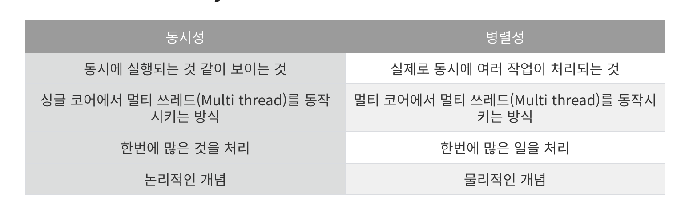
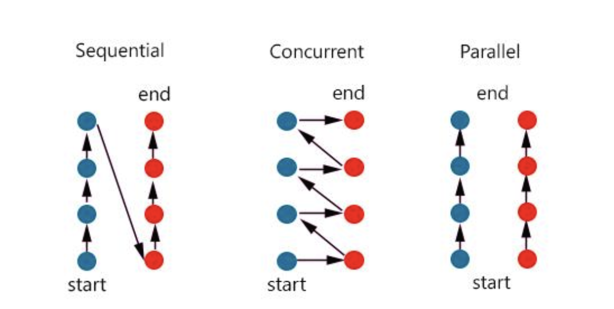
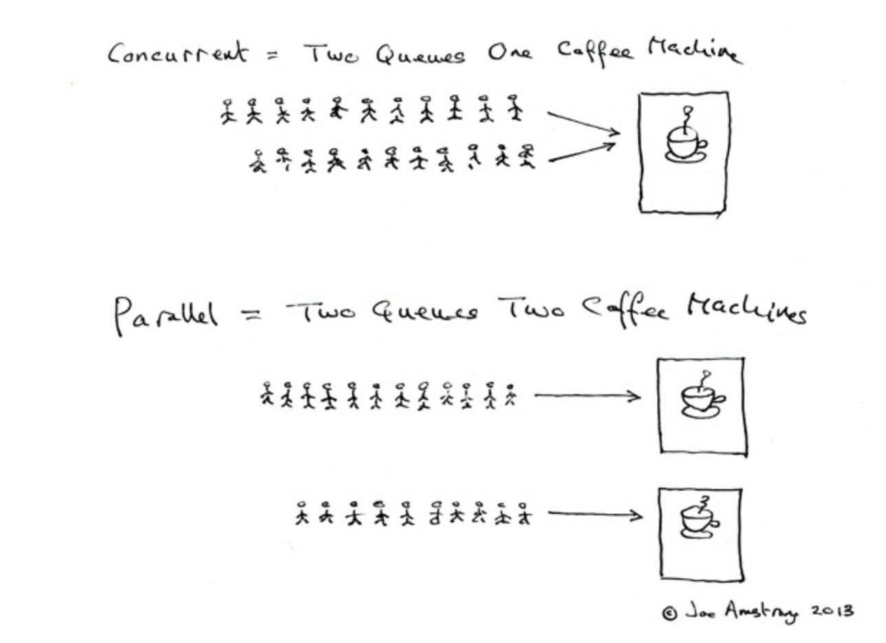

# 동시성

- 동시성 (Concurrency) vs 병렬성 (Parallelism)
  

- 동시에 실행되는 것 같이 보이는 것.
- 싱글 코어에서 멀티 쓰레드(Multi thread)를 동작 시키는 방식
- 한번에 많은 것을 처리
- 논리적인 개념

## 병렬성

- 실제로 동시에 여러 작업이 처리되는 것.
- 멀티코어에서 멀티 쓰레드를 동작시키는 방식
- 한번에 많은 일을 처리
- 물리적인 개념

- 싱글 코어에서는 2개의 작업을 동시에 실행되는 것 처럼 보이기 위해 번걸아 가면서, 작업을 수행한다.
- Context switch가 일어난다.

# 병렬성과의 차이는?

- 코어의 개수가 다르고, 문맥교환이 계속 일어나는 것이, 동시성이다.
