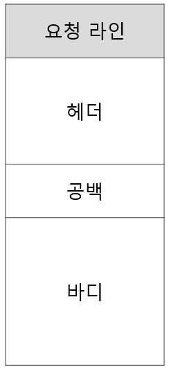

# 인증

- 모든 API 요청에 대해 사용자를 확인하는 작업
- A, B가 동시에 요청을 보냈을 때 누구의 요청인지를 정확히 알아야한다.
- 클라이언트는 서버에 자신이 누구인지를 알만한 단서를 보내야 한다.

## HTTP 요청에 대해

- HTTP 통신은 응답 후 연결을 끊게 되며, 과거 정보를 담지 않는다. 이전 HTTP 요청과 현재 보낸 HTTP 요청은 관계가 없다.

  

- HTTP 메시지 구조, 헤더에는 요청에 대한 정보들이 들어간다.

## 인증 방식

### 1. 계정 정보를 요청 헤더에 넣는 방식

- 헤더에 비밀번호를 담아 보내는 방식

#### 장점 / 단점

- 장점 : 인증 테스트를 빠르게 시도 가능하다.
- 단점 : 보안에 매우 취약하다, 서버에서는 신호가 올때마다 id,pw체크 해야한다.

### 2. Session / Cookie 방식

- 방식 순서
- 1. 사용자가 로그인을 한다.
- 2. 서버에서 사용자 확인 후, 고유한 ID값 부여하여, 세션 저장소에 저장 후 연결되는 세션 ID를 발행한다.
- 3. 클라이언트는 서버에서 해당 세션 ID를 받아 쿠키에 저장, 인증이 필요한 ㅛ청마다 쿠키를 헤더에 실어 보낸다.
- 4. 서버에서는 쿠키를 받아 세션 저장소에서 대조한 후 대응 정보 가져옴.
- 5. 인증 완료 후 서버는 클라이언트에게 맞는 데이터를 보내준다.

#### 설명

- 클라이언트는 쿠키로 보관하고 있다가, 인증이 필요한 요청에 쿠키(세션ID)를 넣어 보낸다. 세션 저장소에서 쿠키를 받고 저장되어 있는 정보와 매칭시켜 인증을 완료한다.

- 인증의 책임을 서버가 지게한다. (서버 해킹이 훨씬 어렵기 때문에)

#### 장점 / 단점

- 장점 : 쿠키 자체 (세션 ID)는 유의미한 값을 갖고 있지 않기 때문에 계정정보를 담아 인증을 거치는 것보다 안전하다. 사용자 별로 고유ID를 발급 받기에 회원정보를 확인할 필요 없이, 어떤 회원인지 확인가능하여, 서버 자원 접근 용이

* 해결책 : HTTPS를 사용해 요청 자체 탈취해도 정보를 읽기 힘들게 한다. 세션에 유효시간을 넣어준다.

- 단점: 쿠키를 탈취당한다면, 훔친 쿠키를 가지고 올바른 사용자로 오인하여, 정보를 잘못 뿌려주게 된다. (세션 하이재킹 공격), 세션 저장을 위한 별도의 저장공간이 필요해지면서 부하가 높아진다.

### 3. 토큰 기반 인증 방식

- 세션 쿠키와 유사한 방식이다.
- Header, Payload, Verify, Signature가 필요하다.

#### Header, Payload, Verify, Signature

- Header: 위 3가지 정보를 암호화할 방식, 타입 등이 들어간다.(16진수 변경)
- Payload: 서버에서 보낼 데이터가 들어간다. 유저의 고유 ID값, 유효기간이 들어간다. (16진수 변경)
- Verify Signature :Base64 인코딩한 Header, Payload와 Secure Key를 더한 후 서명 (SECRET KEY를 알지 못하면 복호화 불가)

결과 : 인코딩된 헤더 + '.' + 인코딩된 페이로드 + '.' + 유효한 서명

- 헤더와 페이로드는 16진수로 인코딩되어있기에, 암호는 들어가면안된다.

#### 방식

- 1. 사용자가 로그인을 한다.
- 2. 서버에서는 계정정보 확인 후, 고유 ID값 부여, 기타 정보와 함께 Payload에 넣는다.
- 3. JWT 토큰 유효기간 설정
- 4. 암호화할 Secret Key를 이용해서 Access Token을 발급
- 5. 사용자는 Access Token을 받아, 인증이 필요한 요청마다 토큰을 헤더에 실어 보낸다.
- 6. 서버에서는 해당 토큰의 Verify Signature를 SECRET KEY로 복호화 후, 조작 여부와 유효기간 확인
- 7. 검증이 완료되었다면, Payload를 디코딩하여 사용자의 ID에 맞는 데이터를 가져온다.

#### 세션 / 쿠키 방식과 JWT방식의 차이

- HTTP 헤더에 세션 ID나 토큰을 싣어서 보내준다는 점은 동일하나,
- 토큰 : 인증을 위해 암호화를 한다.
- 세션 / 쿠키 : 별도의 세션 저장소를 이용하는지에 대한 차이

#### 장점 / 단점

- 장점 : 간편하다. Stateless는 어떠한 별도의 저장소도 사용안한다. 상태를 저장안한다. 확장성이 뛰어나다. 이름이나 이메일 등을 받을 수 있는 권한도 받을 수 있다.

- 단점 1: 이미 발급된 JWT에 대해서는 돌이킬 수 없다. 유효기간이 완료될 떄 까지 계속 사용 가능. 쿠키는 악의적으로 이용시 세션 저장소에서 지워버리면 된다.

* 해결책: Acesss Token의 유효기간을 짧게한다. Refresh Token이라는 새로운 토큰을 발급한다.

- 단점 2: Payload 정보가 제한적이다. 개인정보를 Payload에 넣으면 누구나 디코딩이 가능하기에 Payload에 넣을 수 있는게 제한적이다. 세션 / 쿠키 방식은 서버의 저장소에 안전하게 보관.
- 단점 3: JWT의 길이가 길다. 인증 요청이 빈번할 수록 서버 자원 낭비 발생.

## JWT 방식의 강화버전 Access Token & Refresh Token 방식

### Refresh Token?

- Access 토큰이 만료되었을 때 새로 발급해주는 열쇠가 된다.
- Refresh Token의 유효기간이 2주고, Access Token의 유효기간이 1시간이라고 가정하면, 사용자는 1시간이 지나면, Access Token이 만료된다. 그러면 Refresh Token 만료 전까지 Access Token을 새로 발급 가능.

### Access Token + Refresh Token 인증 과정

- 1. 사용자가 ID, PW를 통해 로그인한다.
- 2. 회원 DB에서 값 비교
- 3. 로그인 완료시, Access Toekn, Refresh Token 발급 후 클라이언트로 전송. 회원 DB에 Refresh Token을 저장해준다.
- 4. 클라이언트는 Refresh Token을 안전한 저장소에 저장 후, Access Token을 헤더에 싣고, 요청을 보낸다.
- 5. Access Token 검증후 맞는 데이터를 보낸다.

#### 만료 후

- 6.  Access Token이 만료된것을 확인 후, 권한 없음 신호로 보낸다.
- 7.  클라이언트는 Refresh Token과 Access Token을 함께 서버로 보낸다.
- 8.  전송받은 Refresh 토큰이 회원 DB에 저장되어있는 Refresh 토큰과 동일하고, 유효기간이 만료가 안되어있다면, Access Token을 발급해준다.
- 9.  서버는 새로운 Access Token을 헤더에 싣고, 다시 API 요청 진행

#### 장점 / 단점

- 장점 : Access Token만 있을 때보다 안전한다. 유효기간을 짧게 하기에
- 단점 : 1. 구현이 복잡하다. 검증프로세스가 길어, 구현하기 힘들어진다. 2. Access Token이 만료될 때마다, 새롭게 발급하는 과정에서 생기는 HTTP 요청 횟수가 많다. 서버의 자원 낭비로 이어진다.

## Oauth

- 외부 서비스의 인증 및 권한 부여 관리.

* 권한 : OAuth는 인증 뿐 아니라, 권한도 관리, 사용자의 권한에 따라 접근할 수 있는 데이터가 다르도록 설정 가능.
* 프로토콜 : 일종의 규약. OAuth라는 규격에 맞춰 인증 및 권한 대행 관리
* 외부 서비스 : 우리가 개발하는 서비스. 외부 서비스를 위한 서비스인 OAuth는 우리 서비스의 인증 및 권한부여를 관리를 대행해준다.

### Notice

- SNS 로그인 기능을 넣더라도 결국 세션/쿠키 방식이나 토큰을 활용해 인증을 거쳐야한다.

## OAuth 2.0

- 1. 모바일 어플리케이션에서도 사용이 용이해짐.
- 2. 반드시 HTTPS를 사용해야하기에 보안이 강화된다.
- 3. Access Toekn의 만료기간이 생겼다.

### OAuth 2.0 인증 방식

- 1. Authorization Code Grant (안증 코드 부여)
- 2. Impicit Grant (암시적 부여)
- 3. Resource Owner Password Credentials Grant (리소스 소유자 암호 자격 증명 부여)
- 4. Client Credentials Grant (클라이언트 자격증명 부여)

### OAuth 2.0의 동작 순서

- Resource Owner : 일반 사용자
- Client: 어플리케이션 서버
- Authorization Server: 권한을 관리하는 서버. Access Token, Refresh Token을 발급, 재발급 해주는 역할
- Resource Server: OAuth2.0을 관리하는 서버(Google, Facebook, Kakao 등)의 자원을 관리하는 서버.

### 인증 순서

- 1. 사용자가 우리 서버에 인증 요청을 보낸다.
- 2. 서버는 인증 요청을 통해 사용자에게 인증할 수단을 보낸다. (카카오, 구글 로그인 URL)
- 3. 일반 사용자는 전송받은 URL에서 로그인을 완료하고, 인증 완료했다는 신호로 권한 증서를 URL에 싣고, 우리 서버에 보낸다.
- 4. 우리 서버는 해당 권한 증서를, Authorization Server로 보낸다.
- 5. Authorization Server는 권한 증서를 확인 후, 유저가 맞다면, 우리 서버에게 Access Token, Refresh Token과 유저의 프로필 정보 등을 발급해준다.
- 6. 우리 서버는 해당 Access Token을 DB에 저장하거나 일반 사용자에게 넘긴다.
- 7. 일반 사용자가 Resource Server의 자원이 필요하면, 우리 서버는 Access Token을 담아 Resource Server에 요청한다.
- 8. Resource Server는 Access Token이 유효한지확인 후, 우리 서버에게 자원을 보낸다.
- 9. Access Token이 만료거나 위조시, 우리 서버는 Authorization Server에 Refresh Token을 보내 Access Token을 재발급 받는다.
- 10. 그리고 다시 Resource Server에 자원을 요청한다.
- 11. 만약 Refresh Token도 만료시, 일반 사용자는 새로운 권한 증서를 우리 서버에게 넘겨야한다. (다시 사용자가 로그인해야한다.)

이전에 봤던 Access Token + Refresh 토큰 방식에서 설명한 방식은 한 서버에서 모두 관리 한다.

### Authorization Server : 인증 + 권한 관리

### Resource Server는 자원에 대한 관리만 한다.

## SNS 로그인

- OAuth 2.0 + 서버 인증(세션/쿠키, 토큰기반 인증)으로 구성된다.

### SNS 로그인 순서

- 1. 사용자가 서버에 로그인을 요청한다.
- 2. 서버가 사용자에게 트겅 쿼리를 붙인 페이스북 로그인 URL을 사용자에게 보낸다.
- 3. 사용자는 해당 URL로 접근하여, 로그인 진행 후 권한증서를 담아 서버에게 보낸다.
- 4. 서버는 해당 권한 증서를 Facebook의 인증 서버로 보낸다.
- 5. 서버는 권한 증서를 확인 후, Access Token, Refresh Token, 유저의 정보(고유 id 포함) 등을 돌려준다.
- 6. 받은 고유 ID를 key값으로 하여, DB에 유저가 있으면 로그인, 없으면 회원가입 진행
- 7. 로그인 완료시 세션/쿠키, 토큰기반 인증 방식을 통해 사용자 인증 처리
