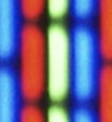
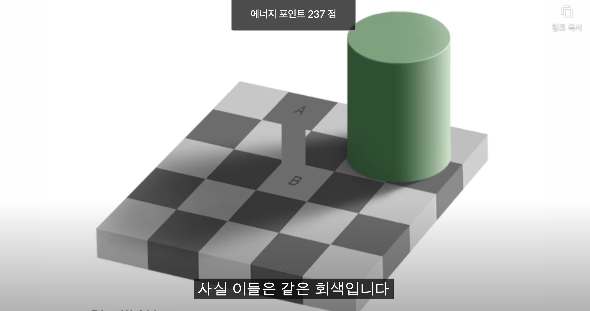
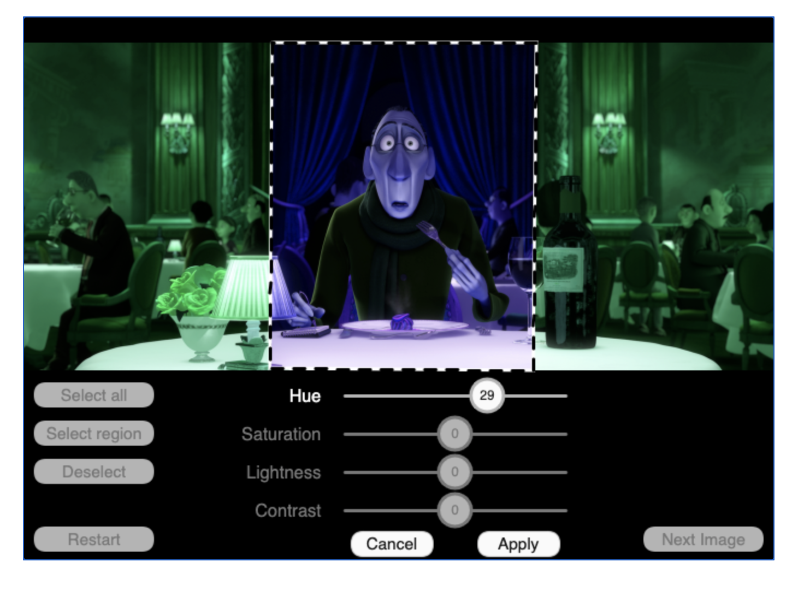
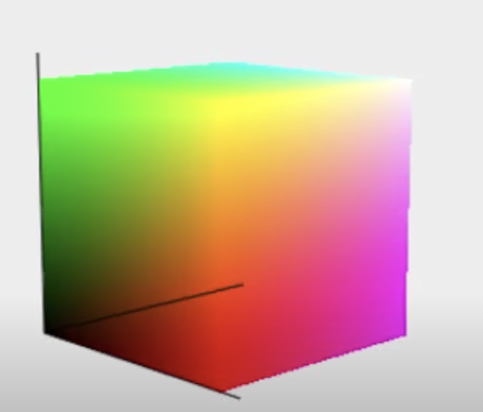
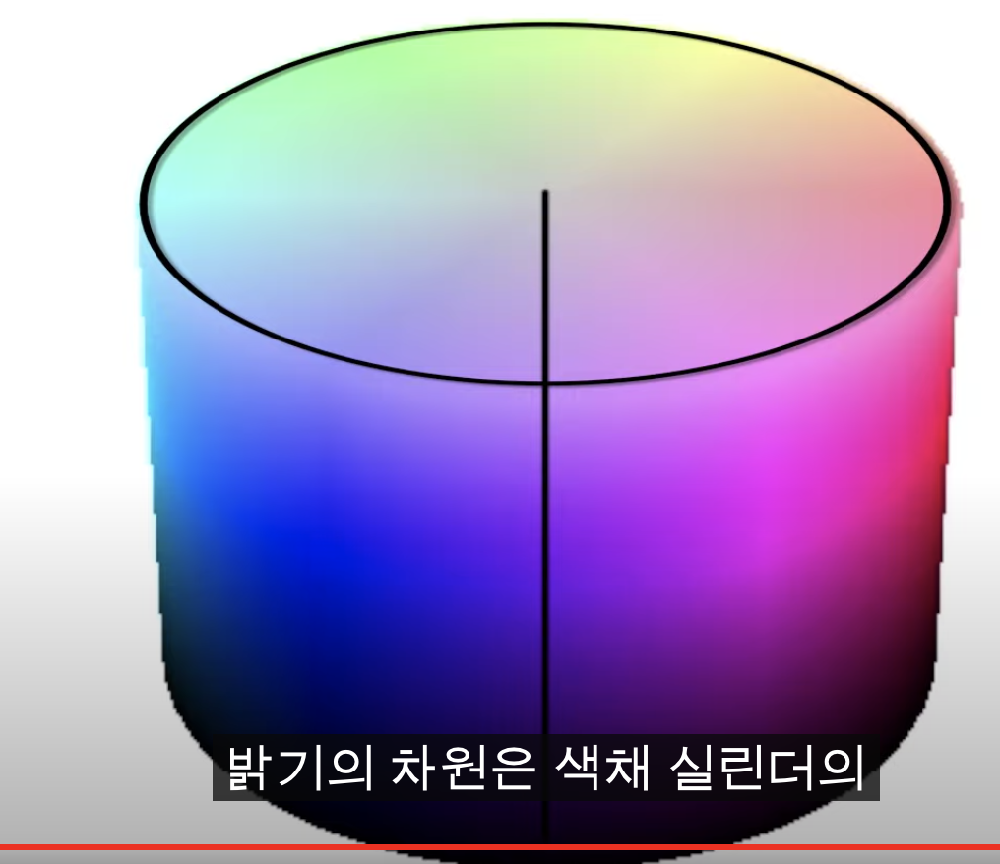
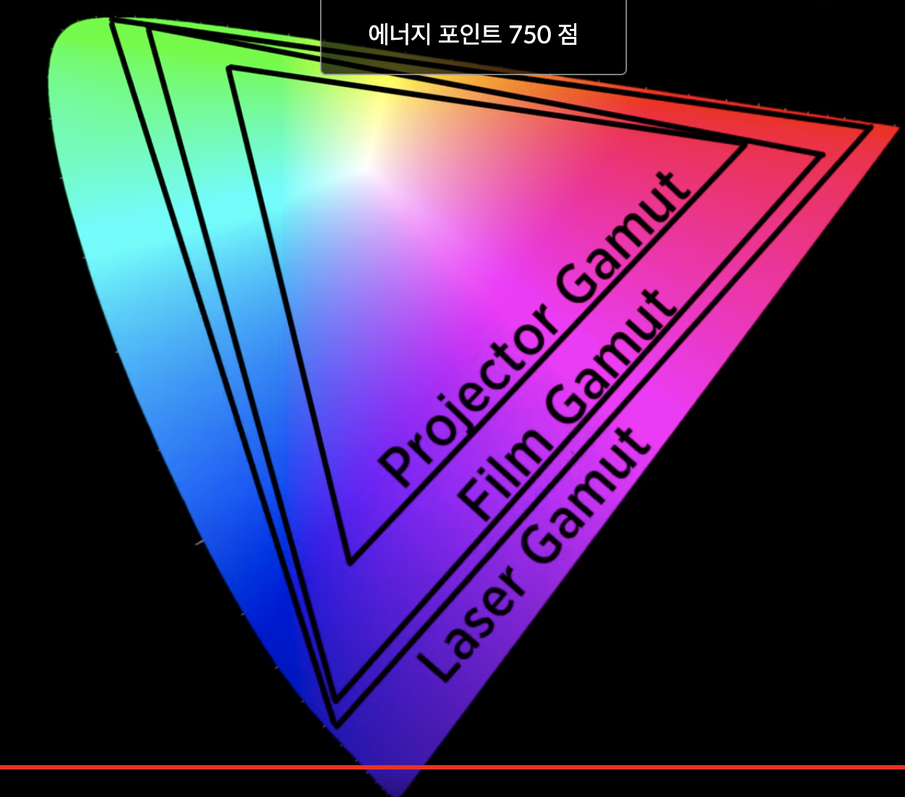

# 색채학

## 1강

- 색상의 구성 요소

  - 색조, 채도, 명도

- 색조

  - 색상환 내에서의 위치를 의미합니다.
  - 노란색 계열인지, 빨간색 계열인지, 파란색 계열인지를 인지시켜줍니다.

- 명도

  - 다른 색에 비해서 얼마나 밝은가를 뜻합니다.
  - 어두운지 밝은지 또는 그 중간을 의미합니다.

- 채도

  - 색이 강렬한 정도를 의미합니다.
  - 가라앉은 회식톤인지, 형광색에 가까울 정도로 선명한지를 의미합니다.
  - 채도가 높은색은 색이 눈에 더 잘뜁니다.

- 색은 사실 빛으로 이루어져 있습니다.
- 색은 다양한 파장의 에너지로 이루어져 있습니다. 그 에너지가 우리의 동공을 지나 안구 속의 망막에 도달하면, 신경 신호로 변환되어, 최종적으로 뇌에서 처리됩니다.
- 색은 우리의 뇌 속에서만 존재하는 것입니다.
- 프리즘은 흰 빛을 여러 파장으로 나눈다. 파란쪽의 빛은 짧은 파장을 가지기 때문에 더 휩니다. 빨간 쪽의 빛은 긴 파장을 가지고 덜 휩니다.
- 레이저는 간섭성 빛을 만드는 광원입니다. 레이저가 아주 작은 범위의 파동을 가진 아주 순전한 색의 빛을 내뿜을 수 있습니다. 오직 작은 범위의 주파수만 가집니다.

## 2강 RGB 색채 모델

- 우리 눈 안에는 특별한 색깔 수용체가 들어있습니다. 이것을 원추세포(특정한 빛의 파장에 예민하게 반응) 라고 부릅니다.
- 긴 파장을 가진 빛이 이 세포들에 닿으면, 스펙트럼의 붉은 쪽의 빛이 닿으면 그에 따른 전기 호를 보냅니다.
- 인간의 눈은 세가지 주요 색깔 수용체를 갖고 있습니다. (더 긴 파장(붉은빛에 민감), 중간 파장(초록빛에 민감), 짧은 파장 (푸른빛에 민감))
- 우리 뇌가 이 세 가지 수용체의 신호를 조합해서 어떤 색깔이든 만들어내는 것입니다.
- 픽셀은 직사각형 및 아주 작은 사각형으로 되어있고, 각 픽셀은 빨강, 초록 그리고 파란 부분을 가지고 있습니다.. 
  
- 빨간색과 초록색 부분이 커지게 하면, 노란색을 형성하게 됩니다.
- 우리는 빨강, 초록, 파랑을 적절히 조합해서 어떤 색상이든 만들어낼 수 있습니다.
- 각 생물마다 다른 원추 세포를 갖는다. 강아지의 경우에는 노랑색과 파랑색에만 민감한 원추세포를 갖고 있어, 빨간색을 인식하지 못합니다.
- 인구 대부분은 세가지만 갖고 있는 반면에 여성들중 테크라크로맷이라고 불리는 사람들의 눈은 네가지의 색깔 수용체를 가지고 있습니다.
- 그래서 아주 비슷한 두 개의 색깔을 구별하는데 아주 탁월한 능력을 보입니다.

* 목표 색은 갈색입니다. 갈색을 만드려면 red 값을 높게, green 값을 중간으로 blue 값을 낮게 해야합니다.

## 3강 HSL 색체 모델

- RGB 색상모델을 갖고, 원하는 색상의 RGB 값을 구하는것은 힘들다. 그래서 색깔을 직감적으로 특정할 수 있도록 새로운 방법을 개발헌 것입니다.
- HUE(색조) (색상환에서의 위치에 기반 - 각도)
- Saturation(채도) (색상환 중심에서의 거리 멀어질수록 색이 강렬해잡나더. 중심에 가까워질수록 회색빛을 띄게됩니다.)
  - 채도를 완전 낮추면, 무색(Achromatic)이 됩니다.
- Lightness(명도)
  - 밝기다 default는 50%에서 출발해서 100%에 가까워질수록 흰색에 가까운 색을 뜁니다.

### - <a href="https://codesandbox.io/s/sangheonkimhsl-color-model-k4zo2">Demo</a>

## 4강 색의 대비

- 색은 고유의 색조와 채도 그리고 명도를 갖습니다. 
  
- 서로 같은 회색이지만 보이는 이미지처럼 밝기나 그림자의 의해 다른 색으로 비춰질 수 있는 것이다.
- 우리가 보는 색상은 대조나 명도를 지각하는데에 있어서 주변 이미지에 영향을 많이 받게된다.
- 우리 시각 시스템은 생존 등의 아주 중요한 목적을 달성하기 위해 최적화되어 있습니다.
- 중요한 생존 기술 중 하나는 빠르게 위험을 감지하는 능력이다. 이것은 우리가 필요할 때 빠르게 다른 곳에 집중할 수 있는 능력을 포함한다.
- 우리의 뇌는 이것들을 위해서 자동적으로 우리의 주의력을 색깔, 명도나 움직임에 있어 엄청난 변화가 있는 곳으로 집중 시킵니다.
- 이것을 색깔의 변화 혹은 조명의 대조(Contrast)라고 부릅니다.
- 우리의 뇌는 색깔의 대조가 있는 곳에 주목하도록 설계가 되어 있습니다. 
  
- 의미를 전달할때 색의 대조를 통해서 전달하기도 합니다. 
  
   
  

> 안에 이색도 초록색과 파란색으로 보이는 선의 색깔도 원래는 같다고 한다. 하지만 색에 대한 인식은 주변색의 영향을 받아서 달라보이는 것이라고 합니다.

## 5강 색채 공간이란

- 개발해보자.
- 점을 3차원 공간에 다음과 같이 x,y,z를 사용하여 나타냅니다.
   
  > 이것이 색채 큐브이다.

## 6강 HSL 색채 공간

- 원의 높낮이는 밝기를 의미하고
- 가운데 선을 기준으로 점이 멀어질수록 saturation의 차이가 보이는 것이고
- 여기서 원을 도는 각도가 색조를 나타낸다. 
  

## 7강 색영역의 소개

- 일반 디스플레이 장치는 흰색 원에있는 색상만큼을 표시할 수 없다. 현재 검정색 삼각형의 꼭지점에 원들까지가 특정 디스플레이 장치의 색영역이라고 볼 수 있다.
- 색영역이란 디스플레이 장치가 색을 나타낼 수 있는 색깔의 범위라고 할 수 있다.
- 사용할 색상이 많으면 더 큰 표현의 자유가 생긴다. 

  

  > 각 디스플레이 장치 마다 색을 나타낼 수 있는 색 영역이 다르다.

cc) https://ko.khanacademy.org/partner-content/pixar/color
