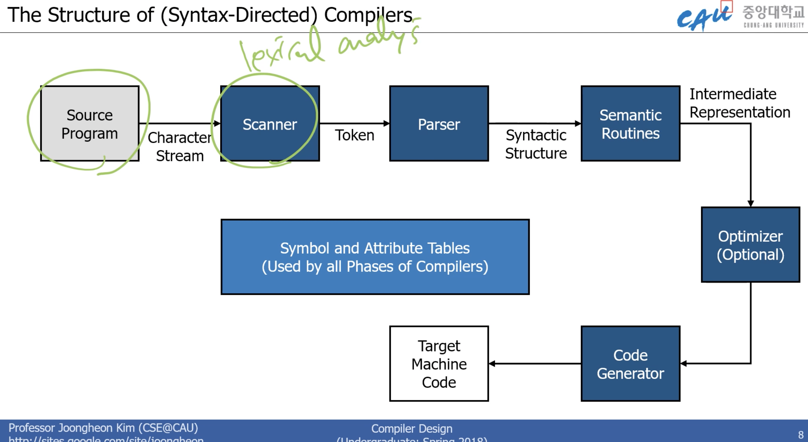

# Compiler Overview

- Compilation
  - gcc.exe -> a.out -> ./a.out
  - 소스파일 -> 컴퓨터가 이해(분석) -> 실행파일 생성(합성)(기계어)
  - 타겟 프로그램이 나오지 않는다.
- Interpretation

  - 소스파일 -> 인터프리터(분석, 실행) -> 결과
  - 바로 결과가 나온다.

- 소스코드 -> 전처리기(선행) -> Source Program -> 컴파일러 -> Target Assembly Program -> 어셈블러 -> Relocatable Object Code -> 링커 + Libraries and Relocatable Object Files -> 기계어 코드가 완성

- 프로그래머 -> (Soruce string)
  - A = B + C;
  - int a;
- 스캐너(performs lexical analysis) -> (Token String)
  - 'A', '=', 'B', '+', 'c', ';'
  - 'int', 'a', ';'
- 파서 (구문 분석) -> parse tree
- Semantic analyzer
- 여기까지가 분석 그 다음 과정 부터 합성을 해야 한다.
- Intermediate code generator -> (Three-address code, quads, or RTL)
- Optimizer -> (Three-address code, quads, or RTL)
- Code generator -> (Assembly code) (한번더 중복을 제거하고 옵티마이징 해준다.)
- Peephole optimizer -> (Assembly code)

- 항상 효율적이고 신뢰성 있는 컴파일러를 만드는 것은 어려운 과제다.

- 사람 -> 컴파일러(이해를 먼저 해야한다.)(Computer Science) -> 컴퓨터가 이해할 수 있는 언어로 만드는 것이다.(Synthesis) (전자과)

- 스캐너

  - 왼쪽부터 오른쪽까지 글자를 하나씩 읽어서, 문자별로 읽어나간다음 빈칸이 나오면 그걸 그룹핑 해준다.

- Lex(c), JavaCC, python lex

- 파서

  - CFG를 이용해서 맞게 구성되어있는지 판단한다.
  - 파싱 도중, 파서들은 검증을 한다 문법상 정확하게 되어있는지, 에러가 발견되면, 에러를 진단한 것을 띄워준다.

- Syntax tree

  - 파싱 트리를 만들어서 옳은 구조인지 확인한다.
  - yacc or javacc, py yacc
  - javacc(top to down) -> yacc(down to top)방식 차이는

- Semantic Routines

  - 분석이 끝난걸 의미가 뭔지는 알았으면 이제 이걸 가지고 합성을 진행한다.

- Optimizer
  - 어셈블러코드로 가기전 코드로 만들어준다.
  - 효과적으로 중복 제거해주고, 최적화 해주는 것.
