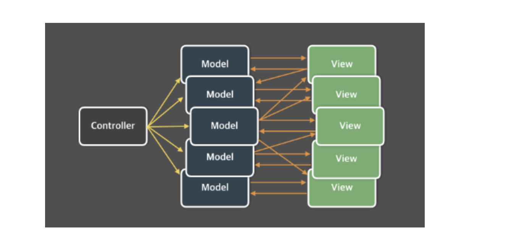
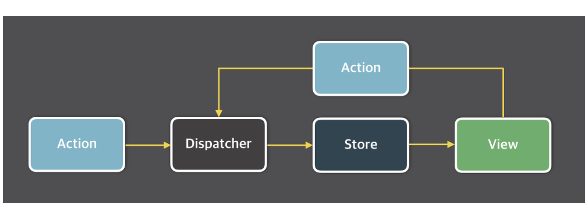

# Flux Architecture

## MVC 아키텍처의 한계

- Controller Model View
- Controller는 Model의 데이터를 조회하거나 업데이트하는 역할을 하고, Model은 이런 데이터를 View 통해 반영시킨다. 또 View는 사용자로부터 데이터를 입력받기도 하기 때문에 사용자의 입력이 Model에 영향을 주기도 한다.

> 서비스가 거대해질수록 너무 복잡해진다는 단점이 있다. 복잡해질 수록 디버깅이 어려워진다.

### 문제점

- 사용자와의 상호작용이 View에서 일어났기 때문에 사용자의 입력에 따라 Model을 업데이트 해줘야 하는 경우가 있고, 여기서 의존성의 이유로 하나의 모델만이 아닌 다른 모델 까지 업데이트해야 할 때도 있다.

### 해결방법

- 단방향 데이터 흐름을 가지는 구조는 데이터는 단방향으로만 흐르고, 새로운 데이터를 넣으면 처음부터 다시 시작되는 방식으로 설계 되어 있다. 이것을 Flux 구조라고 부른다.

## Flux 구조

- 데이터의 흐름은 디스패쳐 -> 스토어 -> 뷰 순서 이며, 뷰에서 입력이 발생하면 액션을 통해서 디스패처로 향하게 된다.
- 디스패쳐, 액션, 스토어, 뷰 하나하나 살펴보자.

### Dispatcher

- 디스패쳐는 Flux 애플리케이션의 모든 데이터 흐름을 관리하는 일종의 허브 역할이다. 액션이 발생하면 디스패쳐로 메시지나 액션 객체나 전달되고 디스패쳐에서는 이러한 메시지 혹은 액션 객체를 콜백 함수를 통해 스토어로 전달한다. 스토어에 접근하기 위한 일종의 단계이고, 액션을 통해 스토어에 접근하기 위해서는 디스패쳐의 단계를 거쳐야 한다.

### Action

- 디스패쳐를 통해 스토어에 변화를 일으킬 수 있는데, 이때 디스패쳐의 데이터 묶음을 액션이라고 한다.
- 예를 들어 GET_POST라는 게시글을 가져와서 스토어의 상태값을 변경해 주는 함수를 실행하고 싶을 때는 GET_POST라는 이름의 액션을 발생 시킨다.

### Store

- 스토어는 애플리케이션의 상태를 저장한다. 모든 상태 변경은 스토어에 의해 결정되며, 상태 변경을 위한 요청을 스토어에 직접할 수는 없다. 상태 변경을 위해서는 꼭 액션 생성자를 통해 디스패쳐 단계를 거친 후 액션을 보내야만 상태값 변경이 가능하다.

### View or View Controller

- 뷰는 상태를 가져와서 보여주고 사용자로부터 입력 받을 화면을 보여준다. 컨트롤러 뷰는 스토어와 뷰의 중간 관리자 같은 역할을 하고 스토어에서 상태 값 변경이 일어났을 때 스토어는 그 사실을 컨트롤러 뷰에서 전달하고, 컨트롤러 뷰는 자신 아래에 모든 뷰에게 새로운 상태를 넘겨준다.

cc) https://velog.io/@alskt0419/FLUX-%EC%95%84%ED%82%A4%ED%85%8D%EC%B3%90%EB%9E%80
