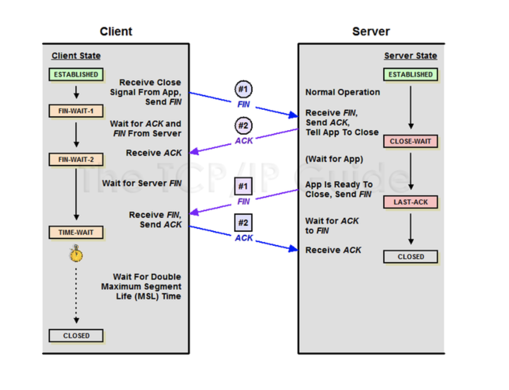

# TCP 3-Way Handshake & 4-Way Handshake

## TCP 3-Way Handshake (연결이 성립되는 과정)

- TCP는 장치들 사이에 논리적인 접속을 성립(establish)하기 위하여 three-way-handshake를 사용한다.
- TCP 3 Way Handshake는 TCP/IP 프로토콜을 이용해서 통신을 하는 응용프로그램이 데이터를 전송하기 전에 먼저 정확한 전송을 보장하기 위해 상대방 컴퓨터와 사전에 세션을 수립하는 과정을 의미

Client -> Server : TCP SYN
Server -> Client : TCP SYN + ACK
Client -> Server : TCP ACK

### TCP의 3-way Handshaking 역할

- 양쪽 모두 데이터를 전송할 준비가 되었다는 것을 보장하고, 실제로 데이터 전달이 시작하기전에 한쪽이 다른 쪽이 준비 되었다는 것을 알 수 있도록 한다.
- 양쪽 모두 상대편에 대한 초기 순차 일련번호를 얻을 수 있도록 한다.

### TCP의 3-way Handshaking 과정

- 1. A 클라이언트는 B서버에 접속을 요청하는 SYN 패킷을 보낸다. 이떄 A 클라이언트는 SYN을 보내고 SYN/ACK 응답을 기다리는 SYN_SENT 상태가 되는 것이다.
- 2. B서버는 SYN 요청을받고 A클라이언트에게 요청을 수락한다는 ACK와 SYN falg가 설정된 패킷을 발송하고, A가 다시 ACK로 응답하기를 기다린다. 이떄 B 서버는 SYN)RECEIVED가 상태가 된다.
- 3. A클라이언트는 B서버에게 ACK를 보내고 이후로부터는 연결이 이루어지고 데이터가 오가게 되는 것이다. 이때의 B서버 상태가 ESTABLISHED가 된다.

## 4-way Handsking (TCP 연결이 해제되는 과정)

### 4-way handshaking

- 1. 클라이언트가 연결을 종료하겠다는 FIN 플래그를 전송한다. (CLIENT(FIN-WAIT), SERVER(ESTABLISHED))
- 2. 서버는 일단 확인(ACK) 메시지를 보내고 자신의 통신이 끝날때까지 기다리는데 이 상태가 TIME_WAIT 상태이다. (Client(FIN-WAIT2), SERVER(CLOSE-WAIT))
- 3. 서버가 통신이 끝났으면 연결이 종료되었다고, 클라이언트에게 FIN 플래그를 전송한다. (SERVER: LAST-ACK, CLIENT: TIME_WAIT)
- 4. 클라이언트는 확인했다는 메시지를 보낸다.(CLOSED, CLOSED)

`CLOSE_WAIT와 TIME_WAIT 상태란 무엇인가?`

- TIME_WAIT 상태로 대기하는(60s) 이유는, 세션 종료 후, 혹시나 네트워크에 아직 라이브 패킷이 존재할수도 있기 때문이다.

cc) https://mindnet.tistory.com/entry/%EB%84%A4%ED%8A%B8%EC%9B%8C%ED%81%AC-%EC%89%BD%EA%B2%8C-%EC%9D%B4%ED%95%B4%ED%95%98%EA%B8%B0-22%ED%8E%B8-TCP-3-WayHandshake-4-WayHandshake#:~:text=3%2DWay%20handshake%EB%8A%94%20TCP,%EC%9C%84%ED%95%B4%20%EC%88%98%ED%96%89%EB%90%98%EB%8A%94%20%EC%A0%88%EC%B0%A8%EC%9E%85%EB%8B%88%EB%8B%A4.
