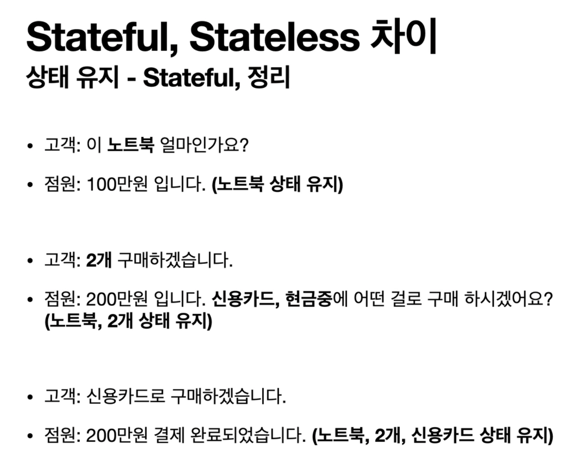
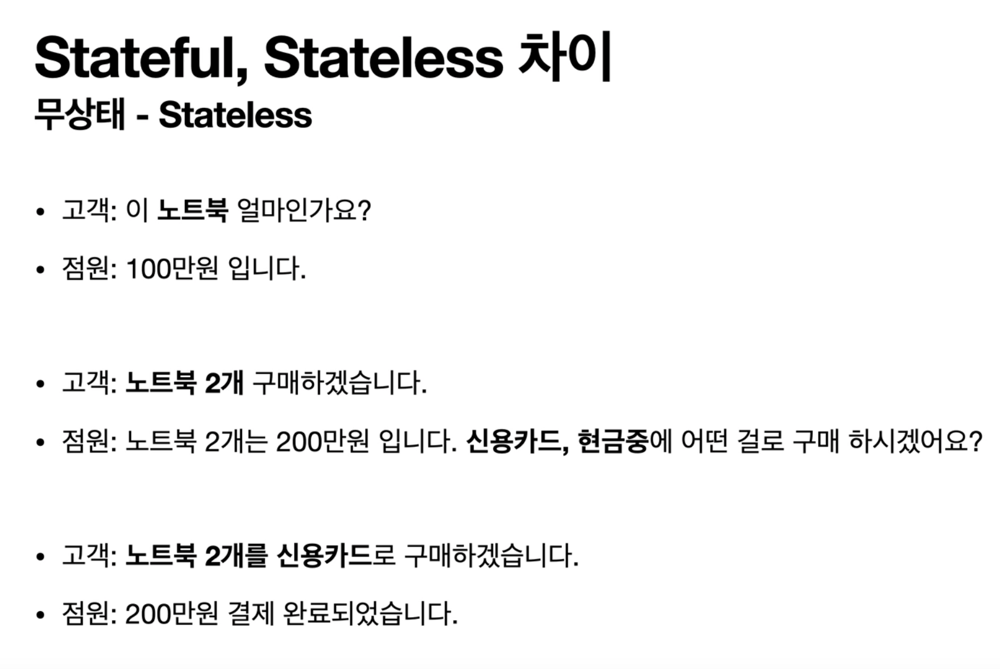

# HTTP

- 모든 것이 HTTP
- 클라이언트 서버 구조
- Stateful, Stateless
- 비 연결성(connectionless)
- HTTP 메시지

## 모든 것이 HTTP (HyperText Transfer Protocol)

- HTTP 메시지에 모든 것을 전송
- HTML, TEXT
- Image, 음성, 영상 파일
- JSON, XML (API)
- 거의 모든 형태의 데이터 전송이 가능
- 서버간에 데이터를 주고 받을 때도 대부분 HTTP를 사용한다.
- 지금은 HTTP 사대

- HTTP/1.1 1997년 : 가장 많이 사용, 우리에게 가장 중요한 버전
  - RFC2068(1997) -> RFC2616(1999) -> RFC7230~7235 (2014)
- HTTP/2 2015년 : 성능 개선
- HTTP/3 진행중 : TCP 대신에 UDP 사용, 성능 개선

### 기반 프로토콜

- TCP : HTTP/1.1, HTTP/2
- UDP : HTTP/3
- 현재 HTTP/1.1을 주로 사용 한다.
  - HTTP/2, HTTP/3도 자주 사용된다.

### HTTP 특징

- 클라이언트 서버 구조
- 무상태 프로토콜(스테이스리스), 비연결성
- HTTP 메시지
- 단순함, 확장 가능

## 클라이언트 서버 구조

- Request Response 구조
- 클라이언트는 서버에 요청을 보내고, 응답을 대기
- 서버가 요청에 대한 결과를 만들어서 응답

## 무상태 프로토콜 (stateless)

- 서버가 클라이언트의 상태를 보존 X
- 장점 : 서버 확장성이 높음(스케일 아웃)
- 단점 : 클라이언트가 추가 데이터를 전송

### Stateful, Stateless 차이

- Stateful
  - 이전에 클라이언트가 무슨 요청을 했는지에 대한 기억 (마치 대화를 이어나가는 듯한 것이라고 생각하자)
    
- stateless
  - 클라이언트는 정확한 요구명세가 필요해진다. 왜냐면 서버는 클라이언트가 이전에 어떤 요청을 했는지에 대해 알 수 없다.
    

`정리`

- 상태 유지: 중간에 다른 점원으로 바뀌면 안된다.
- 무상태 : 중간에 다른 점원으로 바뀌어도 된다.
  - 갑자기 고객이 증가해도 점원을 대거 투입할 수 있다.
  - 갑자기 클라이언트 요청이 증가해도 서버를 대거 투입할 수 있다.
- 무상태는 응답 서버를 쉽게 바꿀 수 있다. -> 무한한 서버 증설이 가능하다.

### Stateless 실무 한계

- 모든 것을 무상태로 설계할 수 있는 경우도 있고 없는 경우도 있다.
- 무상태
  - 예) 로그인이 필요 없는 단순한 서비스 소개 화면
- 상태 유지
  - 예) 로그인
- 로그인한 사용자의 경우 로그인 했다는 상태를 서버에 유지
- 일반적으로 브라우저 쿠키와 서버 세션등을 사용해서 상태를 유지
- 상태 유지는 최소한만 사용한다.

cc) https://www.inflearn.com/course/http-%EC%9B%B9-%EB%84%A4%ED%8A%B8%EC%9B%8C%ED%81%AC/dashboard

- 김영한 선생님의 강의
