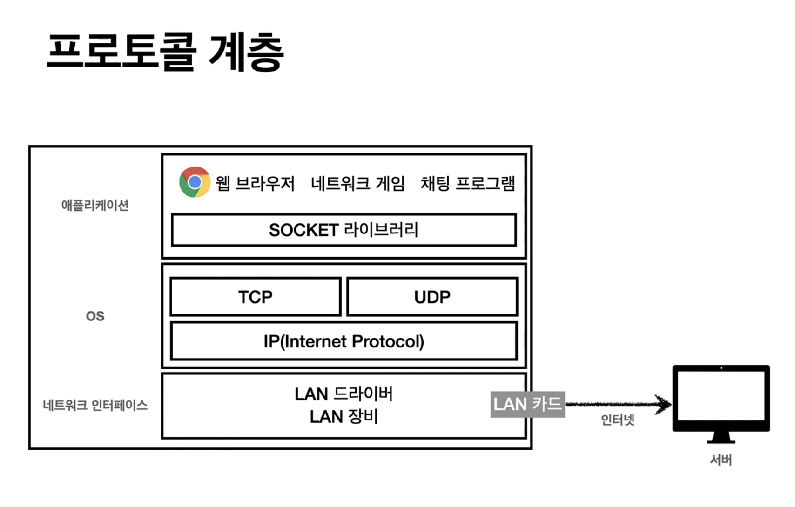

# [인터넷 네트워크]

- 인터넷 통신
- IP(internet Protocol)
- TCP, UDP
- PORT
- DNS

## 인터넷 통신

- 클라이언트 <-> 서버
- 중간에 인터넷이라는 것이 존재한다.
- 복잡한 안터넷 망 (인터넷은 여러개의 노드로 이루어진다.)을 거쳐서 어떻게 서버로 가는지에 대해서는 IP를 이해해야한다.

## IP (인터넷 프로토콜)

- 지정한 IP 주소에 데이터를 전달
- 패킷이라는 통신 단위로 데이터를 전달한다.
- IP 패킷의 정보에는
  -> 전송데이터를 포함하면서, 출발지 IP, 목적지 IP, 기타.. 정보를 가진다.
- 인터넷 망에서는 노드에서 패킷 정보를 확인하면서 전달 전달하여 해당 목적지에 도달하게 되는 것이다.
- 응답 역시 요청 보낸 곳으로 패킷을 다시 던지는데 요청할때와 응답할때의 경로가 다를 수 있다. 인터넷 망은 복잡하기 때문에

### IP 프로토콜의 한계

- 비연결성
  - 패킷을 받을 대상이 없거나 서비스 불능 상태여도 패킷은 전송한다.
- 비신뢰성
  - 중간에 패킷이 사라지거나, 패킷이 순서대로 도착하지 않을 수도 있다.
  - Hello, world 이렇게 보냈는데 상대는 world, hello로 받을 수 있다는 것
- 프로그램 구분
  - 같은 IP를 사용하는 서버에서 통신하는 애플리케이션이 둘 이상인 경우

## TCP

- 전송 제어 프로토콜
- 연결 지향 (TCP 3 way handshake(가상 연결))
- 데이터 전달 보증
- 순서 보장

- 신뢰할 수 있는 프로토콜
- 현재는 대부분 TCP를 사용한다.

- 위에서 말한 IP 프로토콜의 한계를 극복하기 위해 만들어진 것이다.
  
  > 프로토콜 게층
  >
  > 1. 프로그램이 Hello, world 메시지 생성
  > 2. Socket 라이브러리를 통해서 전달
  > 3. TCP 정보 생성, 메시지 데이터를 포함한다.
  > 4. IP 패킷 생성, TCP 데이터 포함
  > 5. NIC를 통해서 서버로 전송된다.

`IP 패킷 정보`

- 출발지 IP, 목적지 IP, 기타...

`TCP 세그먼트`

- 출발지 PORT, 목적지 PORT, 전송 제어, 순서, 검증 정보...

> TCP 3 way handshake
>
> - SYN 접속을 요청
> - ACK 요청을 수락
> - 클라이언트에서 보내는 ACK와 함꼐 데이터를 전송할 수 있다.
>
> 1. 클라이언트가 서버에 전송을 요청 합니다.(Synchronize)
> 2. 서버에서는 SYN과 ACK(응답)를 같이 보내줌으로서 알겠다고 응답해줍니다.
> 3. 최종적으로 클라이언트가 ACK를 보내면서 서로가 연결이 완료된다.
> 4. 그다음 데이터를 전송합니다.

- 데이터 전달 보증

  - 클라이언트가 데이터를 전송하면 서버는 데이터를 잘받았다는 응답을 보내준다.

- 순서 보장
- 클라이언트에서 패킷1, 패킷2, 패킷 3 순서로 전송
- 서버에서 패킷1, 패킷3, 패킷2 이렇게 도착시 패킷 2부터 다시 보내라고 요청할 수 있다.

- 전송제어 정보랑 순서 정보와 검증정보가 TCP 세그먼트에 들어있기때문에 이런것들이 가능한 것이다.

## UDP(User Datagram Protocol)

- 하얀 도화지에 비유 한다.
- 비연결지향이며, 데이터 전달을 보증하지 않고, 순서를 보장하지도 앟는다.
- 데이터 전달 및 순서가 보장되지 않지만, 단순하고 빠르다.
- 정리
  - IP 패킷에서 PORT 정보(용도별로 구분이 가능하다)와, 체크섬 정도가 추가된거라고 보면된다.
  - 애플리케이션에서 추가 작업이 필요하다.

## PORT

- 한번에 둘 이상을 연결하기 위한 것.
- 출발지 IP, PORT, 목적지 IP, PORT, 전송 데이터... 등이 포함된 것이 `TCP/IP` 패킷이다.
  
- 0 ~ 65535까지 할당이 가능하다.
- 0 ~ 1023 잘 알려진 포트다. 사용하지 않는게 좋다.

## DNS

- IP는 기억하기 어렵다.
- IP는 변경될 수 있다.
- 도메인 명을 IP 주소로 변환해준다.
  
  > 1. 도메인명으로 DNS 서버에 요청하면 해당되는 도메인의 IP값을 응답해준다.
  > 2. 클라이언트는 DNS 서버로부터 응답받은 IP로 접속하거나 요청한다.

## 인터넷 네트워크 정리

- 인터넷 통신
- IP(Internet Protocol)
- TCP, UDP
- PORT
- DNS

cc) https://www.inflearn.com/course/http-%EC%9B%B9-%EB%84%A4%ED%8A%B8%EC%9B%8C%ED%81%AC/dashboard

- 김영한 선생님의 강의
