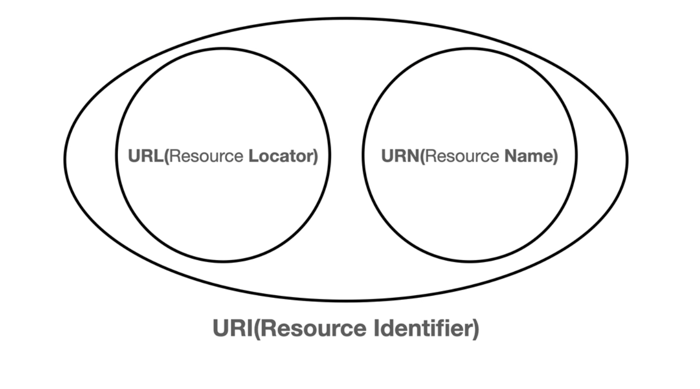

# URI와 웹 브라우저 요청 흐름

## URI (Uniform Resource Identifier)

`URI(Uniform Resource Identifier)`

- Uniform: 리소스 식별하는 통일된 방식
- Resource: 자원, URI로 식별할 수 있는 모든 것(제한 없음)
- Identifier: 다른 항목과 구분하는데 필요한 정보

- 로케이터(locator), 이름(name) 또는 둘다 추가로 분류될 수 있다.
  

`URL (Resource Locator)`

- Locator: 리소스가 있는 위치를 지정

`URN (Resource Name)`

- Name: 리소스에 이름을 부여
  

- 위치는 변할 수 있지만, 이름은 변하지 않는다.

### URI 분석

- scheme://[userinfo@]host[:port][/path][?query][#fragment]
- https://www.google.com:443/search?q=hello&hl=ko

- 프로토콜(https)
- 호스트명(www.google.com)
- 포트 번호(443)
- 패스 (/search)
- 쿼리 파라미터(q=hello&hl=ko)

`scheme`

- 주로 프로토콜을 사용
- 프로토콜 : 어떤 방식으로 자원에 접근할 것인가 하는 약속 규칙
- ex) http, https, ftp 등등
- http는 80 포트, https는 443 포트를 주로 사용, 포트는 생략이 가능하다.
- https는 http에 보안 추가 (HTTP Secure)

`userinfo`

- URL에 사용자 정보를 포함해서 인증
- 거의 사용하지 않는다.

`host`

- 호스트명
- 도메인명 또는 IP 주소를 직접 사용이 가능하다.

`port`

- 포트번호
- 접속 포트
- 일반적으로 생략하고, 생략시 http는 80, https는 443

`path`

- 리소스 경로(path), 계층적 구조
- ex)
  - /home/file1.jpg
  - /members
  - /members/100

`query`

- key=value 형태
- ?로 시작, &로 추가 가능 ?keyA=valueA&keyB=valueB
- query parameter, query string 등으로 불림, 웹 서버에서 제공하는 파라미터, 문자 형태

`fragment`

- fragment
- html 내부 북마크 등에 사용한다.
- 서버에 전송하는 정보가 아니다.

## 웹브라우저 요청 흐름

- `https://www.google.com:443/search?q=hello&hl=ko`

```
- HTTP 요청 메시지
- GET /search?q=hello&hl=ko HTTP/1.1\
  HOST:www.google.com
```

> 이것이 이전시간에 설명한 TCP/IP 패킷의 전송 데이터라고 생각하면 된다.

## HTTP 메시지 전송

- 1.  웹 브라우저가 HTTP 메시지 생성
- 2.  Socket 라이브러리를 통해서 전달
  - A: TCP/IP 연결(IP, PORT)
  - B: 데이터 전달
- 3. TCP/IP 패킷 생성, HTTP 메시지 포함
- 4. 인터넷 망으로 던진다. 그러면 수많은 노드들을 통해서 목적지 서버로 전송이 된다.
- 5. HTTP응답 메시지와 서버에서도 똑같이 TCP/IP 패킷을 생성해서 출발지 서버로 응답을 넘겨준다.
- 6. 그러면 브라우저는 OSI 7 Layer의 응용계층에 브라우저가 해당 HTTP응답 데이터를 확인하여 화면에 렌더링 해주는 것이다.
     
