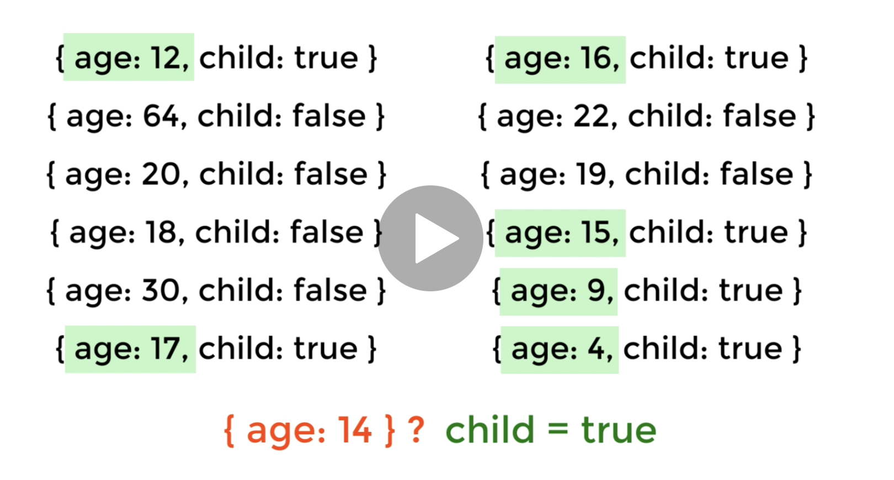
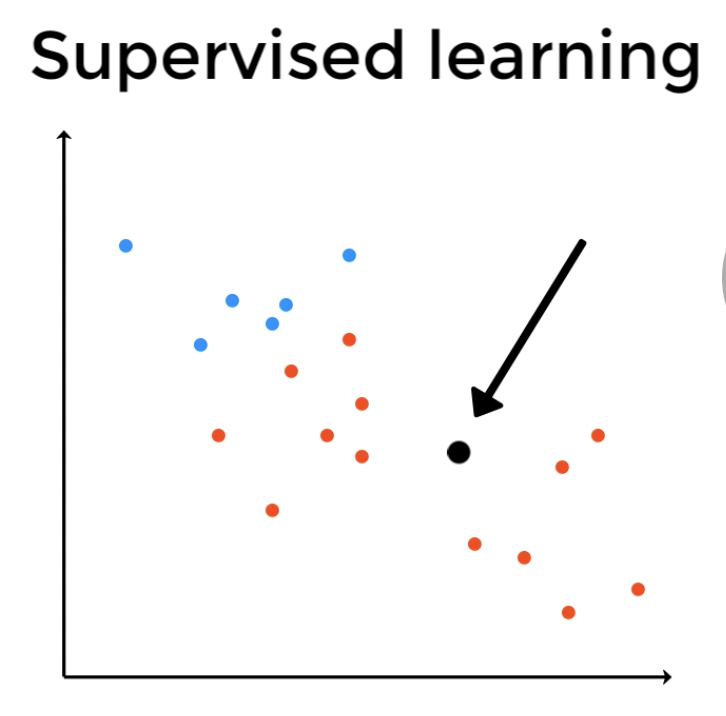
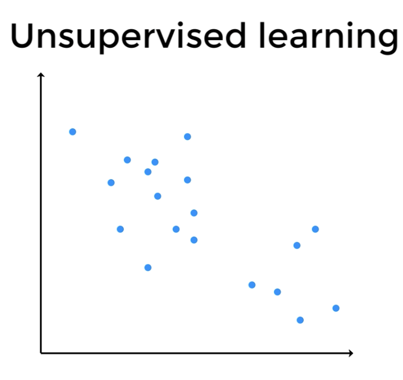
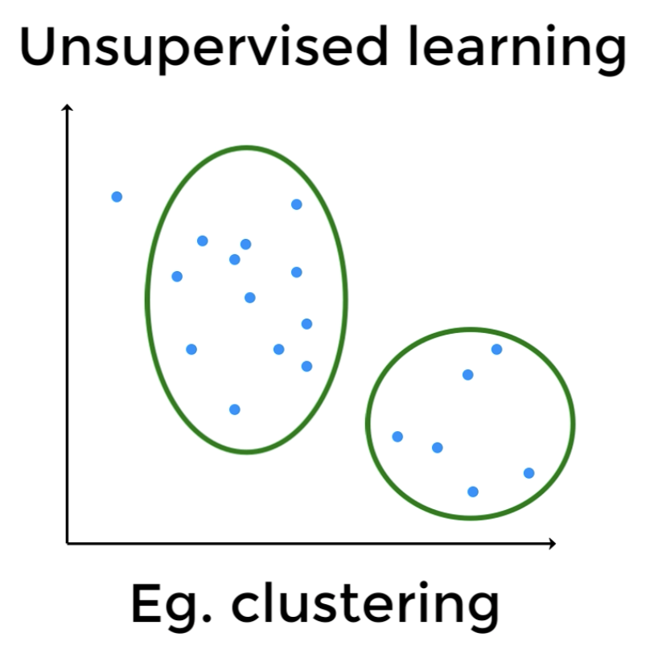
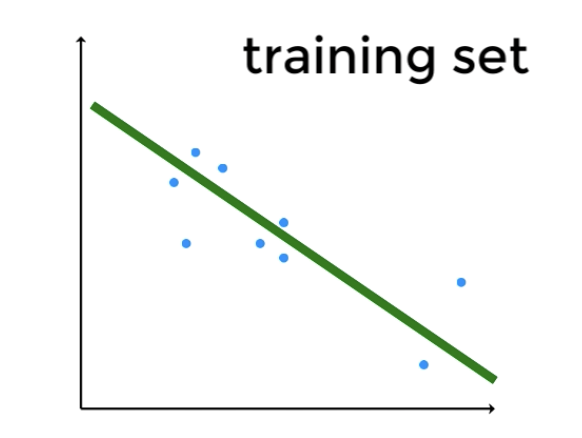
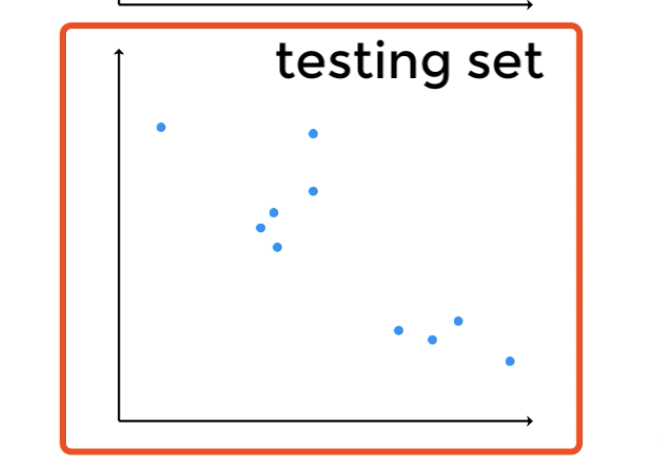
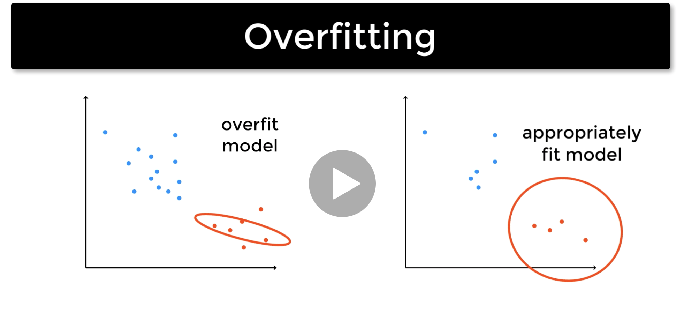

# 머신러닝이란?

- AI의 하위 범주이다.
- 우리는 명시적으로 코딩된 규칙없이 작업을 수행한다. (Perform tasks without explicitly coded rules)
- 규칙이 아닌 데이터를 기반으로 동작한다.

```js
// 규칙에 의한 동작
if (age <= 17) {
  child = true;
}
```

`데이터를 기반으로 확인하는 것`

- 패턴을 찾으면 아직 보지 못한 새로운 데이터 항목에 사용할 수 있다.
  

  > 위의 예시 같은 경우에는 굳이 기계 학습을 사용할 필요가 없다. 하지만, 복잡한 문제의 경우 머신 러닝적 접근이 명시적 규칙 보다 효율적일 수 있다.

- 대부분의 기계 학습 작업은 일종의 예측이다.
- 기계 학습 접근 방식의 한 가지 결과는 경험을 통해 개선 된 결과를 볼 수 있다는 것이다.
- 위 말은 데이터가 많을 수록 알고리즘이 더 많이 학습하고 예측이 향상됨을 의미한다.
- 기계 학습 알고리즘은 종종 생물학적 학습을 기반으로 한다. (생물학적 기반에 기반한 인공신경망 사용)

## 지도 학습과 비지도 학습

- 머신러닝은 지도학습 또는 비지도 학습으로 나뉜다.

### 지도 학습

- 레이블을 추가한 데이터 세트가 있고, 해당 데이터에 대해 알고리즘을 훈련 시킨다.
- 여기에서 일부 데이터의 float를 볼 수 있으며, 포인트는 색상별로 레이블이 지정되어 있다.
  

> 위 사진대로라면 검은 점이 빨간색이 될지 예측이 가능해진다. 분류라고 불리우는 지도학습 작업이다.

### 비지도 학습

- 알고리즘 훈련을 위한 데이터 세트가 없다.
- 대신 우리는 우리가 이용할 수 있는 데이터의 패턴을 식별하려고 한다.
- 일반적인 비지도 작업은 클러스터링이다. 여기서 데이터 포인트가 있고, 클러스터를 식별하려고 한다.
  - 
    > 데이터의 패턴을 식별하려고 한다.
  - 
    > 클러스터를 식별하여, 우리가 알지 못했던 패턴을 발견할 수 도 있다.
- 지도 학습과 같은 과거 경험, 지도학습이 더 일반적이며, 이것이 우리의 초점이 될 것이다.
- 지도 학습에서 취할 접근 방식은 데이터 세트를 사용하여 모델을 학습 시키는 것이다.



> 이것은 모델 학습에 사용할 훈련 데이터 세트이다.

- 우리 모델은 이미지에서 데이터 셋들을 통과하는 선이 될 수 있다. (이것이 선형 회귀)



> 모델이 훈련에서 보이지 않는 데이터에 대해 잘 작동하는지 확인하기 위한 테스트 데이터 세트

`지도학습의 3단계 프로세스`

- 훈련 세트, 테스트 세트 및 검증 세트

`머신 러닝 시에 가장 주의해야할 문제는 과적합이다.`

- 모델의 구성을 확인하고 더 적절한 적합성을 찾기 위해서는 재 학습을 하자
  

  ### 손실 함수

- 모델이 얼마나 좋은지 확인하려면 데이터 세트에 적합한 손실함수를 사용하자.
- 손실 함수는 각 점에서 선까지의 거리를 계산한다.
- 모든 포인트에 대해 측정하고 평균을 구해줘야 한다.
- 전형적인 손실함수 : 매개변수를 업데이트 하는 방법을 결정하는 최적화 알고리즘의 도움으로 수행한다.
- 모델 학습시에 손실 값을 최소화 하는 것을 목표로 한다.
