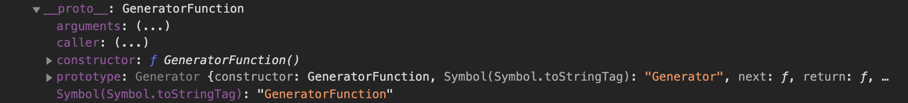

# 제너레이터

- function\* 키워드를 사용한 함수

- 제너레이터 함수 형태

```js
// 제너레이터 함수 선언문
function* genDecFunc() {
  yield 1;
}

let generatorObj = genDecFunc();

// 제너레이터 함수 표현식
const getExpFunc = function* () {
  yield 1;
};

generatorObj = getExpFunc();

// 제너레이터 메소드
const obj = {
  *generatorObjMethod() {
    yield 1;
  },
};

generatorObj = obj.generatorObjMethod();

// 제너레이터 클래스 메소드
class MyClass {
  *generatorClsMethod() {
    yield 1;
  }
}

const myClass = new MyClass();
generatorObj = myClass.generatorClsMethod();

// Object의 프로토타입에서 제너레이터 생성자를 꺼내어 할당해주는 방식
// generator Function constructor를 빼와서 Music에 할당하면 생성자 함수가 된다.
const Music = Object.getPrototypeOf(function* () {}).constructor;

const gen = new Music();
```

`Object.getPrototypeOf(function*) 을 찍어보자`


- 제너레이터 함수를 호출하면 함수 블록을 실행하는 것이 아닌, Generator 오브젝트를 생성하여 반환한다.

```js
function* sports(one, two) {
  yield one + two;
}

console.log(typeof sports);
const obj = sports(1, 2);
console.log(typeof obj); // object
console.dir(obj);
console.log(obj.next()); // [Symbol.iterator]() 함수를 호출하지 않고도 next메서드를 쓸 수 있으면서 Symbol.iterator를 갖고 있다니... 이건 곧 이터러블 프로토콜을 준수하면서 이터레이터 프로토콜을 준수한다고 볼 수 있겠다.
```

- 제너레이터 오브젝트를 반환한 것이다. 제너레이터 오브젝트는 이터러블 오브젝트이면서 이터레이터 오브젝트이다. 왜냐고?
  
  > console.dir(obj)의 결과 이다. 보면 프로토타입 체인에 Symbol.iterator 메서드를 갖고 있으면서 next메서드 역시 갖고 있기 때문이다.
  > sports 역시도 제너레이터 함수이지만 Non-constructor이다. 따라서 new 연산자 사용불가하다.
  > new 연산자는 사용이 불가능하다. obj를 콘솔 찍어보면 타입이 object로 나온다. 일반 객체는 non-constructor이다. 그리고 무엇보다 non-callable 이기에 호출이 불가능해서 인스턴스를 생성하기 위해 사용하는 new 연산자를 사용할 수 없다.
- 이터레이터 오브젝트는 next메서드가 호출되기 전까지는 평가되지 않는다. 이전시간에 이터레이터에 대해서 설명을 했기에 설명은 생략하도록 하겠다.


> 일반 함수선언문의 경우에 prototype 프로퍼티를 가지면서, constructor를 갖고 있지만,
> 
> 제너레이터 함수를 찍어보면 non-constructor기에 new 연산자 사용 불가다.

## function\* 표현식

- 표현식의 경우에는 함수 이름을 작성할 필요가 없다. 함수이름은 함수 내부에서만 호출가능하다.
- 식별자에 제너레이터 함수를 할당해준다.

```js
const sports = function* (one) {
  yield one;
};

const obj = sports(100);
console.log(obj.next());
```

## GeneratorFunction

```js
// Object의 프로토타입에서 제너레이터 생성자를 꺼내어 할당해주는 방식
// generator Function constructor를 빼와서 Music에 할당하면 생성자 함수가 된다.
const Music = Object.getPrototypeOf(function* () {}).constructor;

const gen = new Music("one", "yield one");
console.dir(gen);
const obj = gen(100);
console.log(obj.next());
```



> GeneratorFunction 생성자 함수를 이용하여 호출시 prototype 프로퍼티에 내장되어있는 next, returns, throw등을 사용할 수도 있다.

## yield

- Syntax : [ReturnValue] = yield [표현식]
- yield 키워드 사용 형태
  - next()로 호출할 때마다 하나씩 실행 한다.
- yield 키워드는 제너레이터 함수 실행을 멈추거나, 다시 실행할때 사용한다.
- 별도의 표현식을 작성하지 않으면 undefined를 반환한다.

- [returnValue]는 오른쪽의 평가 결과가 설정되지 않고, 다음 next()에서 인수로 전달한 값이 설정된다.

```js
function* sports(one) {
  const value = yield one + 10;
  yield value;
  const res = yield one + 50;
  yield res;
}
const obj = sports(30);
console.log(obj.next()); // {value: 40, done: false}
console.log(obj.next(50)); // {value: 50, done: false} - value에는 여기서 넘겨준 50이 할당된다.
console.log(obj.next()); // {value: 80, done: false} - 표현식은 one + 50이기에 80을 리턴해준다. one이 30이 들어가있기에
console.log(obj.next(200)); // {value: 200, done: false} res에 200을 할당해주고, 200을 리턴해주게된다.
console.log(obj.next(300)); // {value: undefined, done: true} yield가 모두 끝났기에 unfeind반환해주고 done은 true로 반환해준다.
```

- yield 표현식을 평가하면, 호출한 곳으로 {value: 값, done: true/false} 반환
- `value 값`

  - yield 표현식의 평가 결과를 설정한다.
  - yield를 실행하지 못하면 undefined

- `done 값`
  - yield를 실행하면 false
  - yield를 실행하지 못하면 true

```js
function* sports(pne) {
  yield one;
  const check = 20;
  yield check;
}

const obj = sports(10);
console.log(obj.next()); // {value: 10, done: false}
console.log(obj.next()); // {value: undefined, done: true} // yield가 하나만 있고, yield는 이미 앞에 한번 실행되어있다. 고로 yield를 실행할 수 없어서 value는 undefined를 done: true를 반환하게 된 것이다.
```

```js
function* sports(one) {
  let two = yield one;
  let param = yield one + two;
  yield param + one;
}

const obj = sports(10);
console.log(obj.next()); // 10, false
console.log(obj.next()); // NaN, false
console.log(obj.next(20)); // 30, false
console.log(obj.next()); // undefined, true

const obj2 = sports(10);
console.log(obj2.next()); // 10, false
console.log(obj2.next(30)); // 40, false
console.log(obj2.next(20)); // 30, false
console.log(obj2.next()); // undefined, true
```

> 이것을 통해 알 수 있는건 결과값은 할당되지 않고, 다음 next()메서드에 인수로 전달되는 값이 변수에 할당되는 것을 알 수 있다.

## next()

- 파라미터값으로는 제너레이터로 넘겨줄 파라미터값이다.
- next()는 yield 수만큼 작성해야 yield 전체를 실행

- next()를 호출하면 이전 yield의 다음부터 yield 까지 실행한다.

`예제1 - 이전 yield의 다음부터 yield까지 실행`

```js
function* generator(value) {
  let value2 = value + 20;

  const param = yield ++value2;
  value2 = param + value2;
  yield ++value2;
}
const obj = generator(10);
console.log(obj.next()); // { value: 31, done: false }
console.log(obj.next(20)); // { value: 52, done: false } // param에 20을 할당해주고, 20 + 31 = ++51 = 52를 반환
```

`yield를 작성하지 않았을 때`

```js
function* generator(value) {
  ++value;
  console.log(value);
}
const obj = generator(10);
console.log(obj.next()); // {value: undefined, done: true}
```

- 실행할 yield가 없기에 undefined를 반환하고, done은 true로 반환한다.

`제너레이터 함수에 return 문을 작성했을 때`

```js
function* generator(value) {
  return ++value;
}
const obj = generator(10);
console.log(obj.next()); // {value: 11, done: true}
console.log(obj.next()); // {value: undefined, done: true}
```

> return 문 사용시에는 value는 반환하지만 done은 true를 반환하게 된다.

- 제너레이터 함수는 제너레이터 오브젝트를 생성할 때 초깃값을 설정한다.
- next()로 실행할 때마다 초깃값을 설정하지 않는다.

```js
const generator = function* (param) {
  const one = param + 10;
  yield one;
  var two = 2;
  yield one + two;
};

const obj = generator(10);
// param에 10이 있다는 것은 generator 함수 안으로 들어간 것이다.
// geenerator 함수가 호출되어, 실행 컨텍스트의 초기화 단계에서 초기값을 설정한 것이다.
// 단지 함수 안의 코드는 실행하지 않은 것이다.
debugger;

console.log(obj.next()); // {value: 20, done: false}
console.log(obj.next()); // {value: 22, done: false}
```

## yield 반복

```js
let status = true; // status가 false가 될때까지 무한정 생성하기 위함
function* generator() {
  let count = 0;

  while (status) {
    yield ++count;
  }
}

const obj = generator();
console.log(obj.next()); // {value: 1, done: false}
console.log(obj.next()); // {value: 2, done: false}
status = false; // 수행을 끝내기 위해 false 지정
console.log(obj.next()); // {value: undefined, done: true}
// done이 true면 이터레이터를 더이상 사용할 수 없다.
```

`다수의 yield 처리`

```js
function* generator() {
  return yield yield yield;
}

const obj = generator();
console.log(obj.next(10)); // {value: undefined, done: false}
console.log(obj.next(10)); // {value: 10, done: false}
console.log(obj.next(20)); // {value: 20, done: false}
console.log(obj.next(30)); // {value: 30, done: true} 여기서는 리턴을 타기에 done true반환
```

> 첫번째로 넘겨주는건 전달이 되지 않는다.

## yield 분할 할당

- 대괄호[] 안에 다수의 yield 작성
  - return [yield yield]

```js
function* generator() {
  return [yield yield];
}

const obj = generator(); // 처음 obj.next는 아무것도 전달받지 못합니다.
console.log(obj.next()); // {value: undefined, done: false}
console.log(obj.next(10)); // {value: 10, done: false}
const last = obj.next(20);
console.log(last); // {value: [20], done: true}
console.log(last.value); // [20]
```

## for...of 문으로 반복

```js
function* generator(count) {
  // 인수로 전달된 수를 기준으로 초기화 해준다.
  while (true) {
    // 무한 루프 돌리면서 지연평가되기에
    yield ++count; // 인수로 전달된 수로 초기화된 수를 기준으로 카운트를 1씩 증가시키면서 반환해준다.
  }
}

for (let point of generator(10)) {
  console.log(point); // 11 12 13
  if (point > 12) break;
}
```

## 제너레이터 오브젝트 메서드 : return(), throw()

```js
function* generator(count) {
  while (true) {
    yield ++count;
  }
}

const obj = generator(10);
console.log(obj.next()); // {value: 11, done: false}
console.log(obj.next(50)); // {value: 12, done: false} yield가 카운트를 반환하도록되어있기에 전달한건 의미가 없어진다.
console.log(obj.return(70)); // {value: 70, done: true}
// return()의 파라미터값을 value로 설정하고, done을 true로 반환 이후 next()메서드는 더이상 제너레이터를 사용할 수 없어, undefined 반환
console.log(obj.next(40)); // {value: undefined, done: true}
```

### return()

- 이터레이터를 종료 시킨다. 파라미터 값을 value에 전달해주긴한다.

### throw()

- Error를 의도적으로 발생시킨다.

`제너레이터 함수의 catch() 문에서 에러를 받는다.`

```js
function* generator() {
  try {
    yield 10;
  } catch (message) {
    yield message;
  }
  yield 20;
}

const obj = generator();
console.log(obj.next()); // {value: 10, done: false}
// throw는 이터레이터를 종료 시키지는 않는다.
console.log(obj.throw("에러 발생")); // {value: "에러 발생", done: false}
console.log(obj.next()); // {value: 20, done: false}
```

`제너레이터 함수에 throw 문을 작성`

```js
function* generator() {
  throw "에러 발생";
  yield 10;
}

const obj = generator();
try {
  const result = obj.next();
} catch (message) {
  console.log(message); // 에러 발생
}
console.log(obj.next()); // 이터레이터 종료 {value: undefined, done: true}
```

## yield\*

- Syntax: yield\* 표현식
- yield\*의 표현식에 따라 처리하는 방법이 다르다.

### `yield\*의 표현식이 배열인 경우 next()로 호출할 때마다 배열의 엘리먼트를 하나씩 처리`

```js
function* generator() {
  // 왼쪽에서 오른쪽으로 순서대로 반환한다.
  yield* [10, 20];
}

const obj = generator();
console.log(obj.next()); // {value: 10, done: false}
console.log(obj.next()); // {value: 20, done: false}
console.log(obj.next()); // {value: undefined, done: true}
```

### `yield*의 표현식이 제너레이터 함수인 경우`

- 제너레이터 함수를 걸어놓으면 제너레이터 함수를 다돌고 나온다음 그다음 yield를 수행한다.

```js
function* point(count) {
  yield count + 5;
  yield count + 10;
}

function* generator(value) {
  yield* point(value); // 제너레이터 오브젝트를 생성하고 첫번째 yield를 실행해준다.
  // 두번째 next()메서드 호출시에는 point제너레이터함수로 이동해서 yield를 또 실행할게 있는지 보고 있다면 실행 그래서 20을 반환
  yield value + 20; // 세번쨰 메서드 호출시에 더이상 point제너레이터 함수에는 실행할게 없으므로 이 라인에 yield를 실행해준다. 따라서 30반환
}

const obj = generator(10);
console.log(obj.next()); // {value: 15, done: false}
console.log(obj.next()); // {value: 20, done: false}
console.log(obj.next()); // {value: 30, done: false}
```

### yield\*의 재귀 호출

```js
function* generator(point) {
  yield point;
  yield* generator(point + 10);
}

const obj = generator(10);
console.log(obj.next()); // {value: 10, done: false}
console.log(obj.next()); // {value: 20, done: false}
console.log(obj.next()); // {value: 30, done: false}
```

> 지연평가가 이루어지기 때문에 무한루프가 돌지 않는다.
