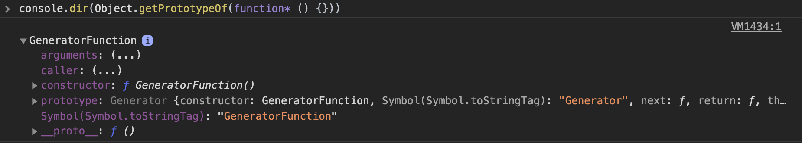
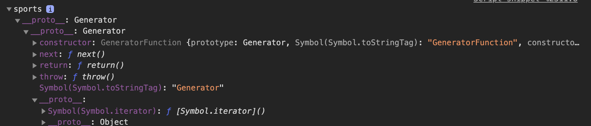
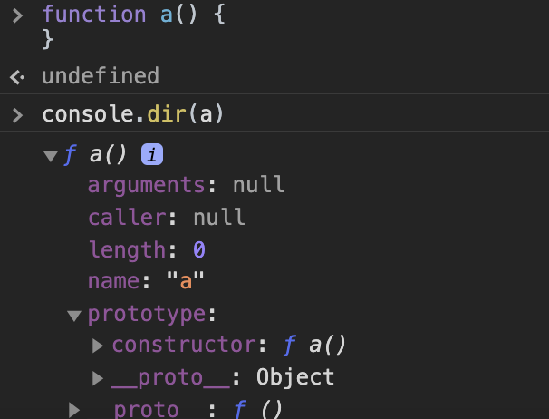
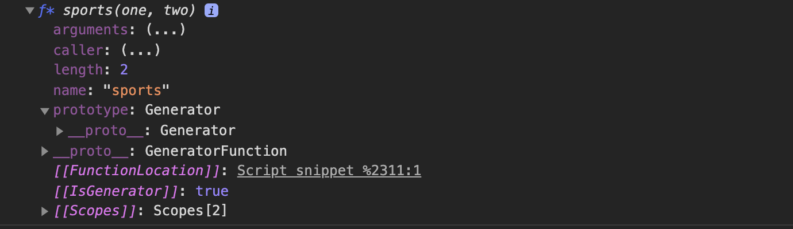

# 제너레이터

- function\* 키워드를 사용한 함수

- 제너레이터 함수 형태

```js
// 제너레이터 함수 선언문
function* genDecFunc() {
  yield 1;
}

let generatorObj = genDecFunc();

// 제너레이터 함수 표현식
const getExpFunc = function* () {
  yield 1;
};

generatorObj = getExpFunc();

// 제너레이터 메소드
const obj = {
  *generatorObjMethod() {
    yield 1;
  },
};

generatorObj = obj.generatorObjMethod();

// 제너레이터 클래스 메소드
class MyClass {
  *generatorClsMethod() {
    yield 1;
  }
}

const myClass = new MyClass();
generatorObj = myClass.generatorClsMethod();

// Object의 프로토타입에서 제너레이터 생성자를 꺼내어 할당해주는 방식
// generator Function constructor를 빼와서 Music에 할당하면 생성자 함수가 된다.
const Music = Object.getPrototypeOf(function* () {}).constructor;

const gen = new Music();
```

`Object.getPrototypeOf(function*) 을 찍어보자`


- 제너레이터 함수를 호출하면 함수 블록을 실행하는 것이 아닌, Generator 오브젝트를 생성하여 반환한다.

```js
function* sports(one, two) {
  yield one + two;
}

console.log(typeof sports);
const obj = sports(1, 2);
console.log(typeof obj); // object
console.dir(obj);
console.log(obj.next()); // [Symbol.iterator]() 함수를 호출하지 않고도 next메서드를 쓸 수 있으면서 Symbol.iterator를 갖고 있다니... 이건 곧 이터러블 프로토콜을 준수하면서 이터레이터 프로토콜을 준수한다고 볼 수 있겠다.
```

- 제너레이터 오브젝트를 반환한 것이다. 제너레이터 오브젝트는 이터러블 오브젝트이면서 이터레이터 오브젝트이다. 왜냐고?
  
  > console.dir(obj)의 결과 이다. 보면 프로토타입 체인에 Symbol.iterator 메서드를 갖고 있으면서 next메서드 역시 갖고 있기 때문이다.
  > sports 역시도 제너레이터 함수이지만 Non-constructor이다. 따라서 new 연산자 사용불가하다.
  > new 연산자는 사용이 불가능하다. obj를 콘솔 찍어보면 타입이 object로 나온다. 일반 객체는 non-constructor이다. 그리고 무엇보다 non-callable 이기에 호출이 불가능해서 인스턴스를 생성하기 위해 사용하는 new 연산자를 사용할 수 없다.
- 이터레이터 오브젝트는 next메서드가 호출되기 전까지는 평가되지 않는다. 이전시간에 이터레이터에 대해서 설명을 했기에 설명은 생략하도록 하겠다.



> 일반 함수선언문의 경우에 prototype 프로퍼티를 가지면서, constructor를 갖고 있지만,
> 
> 제너레이터 함수를 찍어보면 non-constructor기에 new 연산자 사용 불가다.

### function\* 표현식

- 표현식의 경우에는 함수 이름을 작성할 필요가 없다. 함수이름은 함수 내부에서만 호출가능하다.
- 식별자에 제너레이터 함수를 할당해준다.

```js
const sports = function* (one) {
  yield one;
};

const obj = sports(100);
console.log(obj.next());
```
