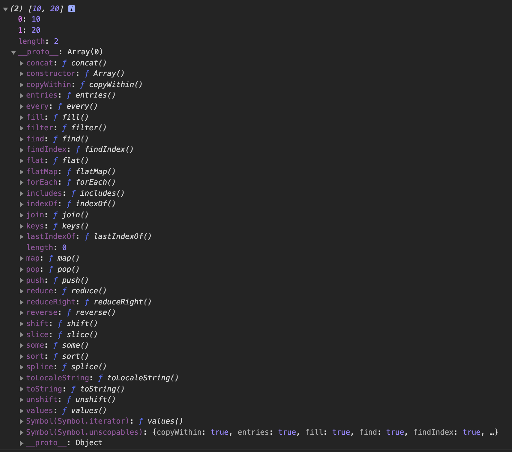
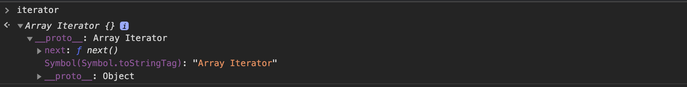
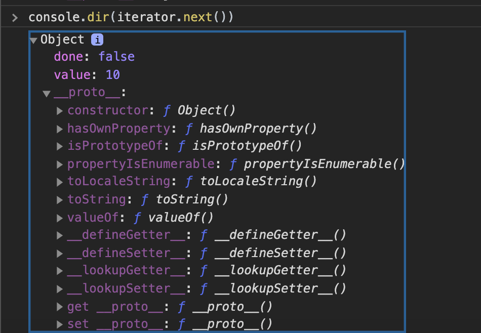
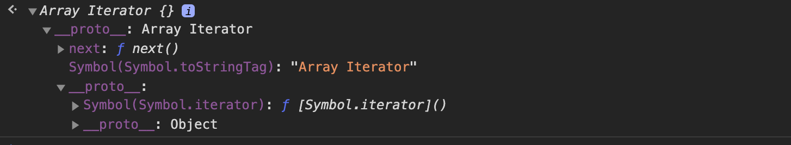
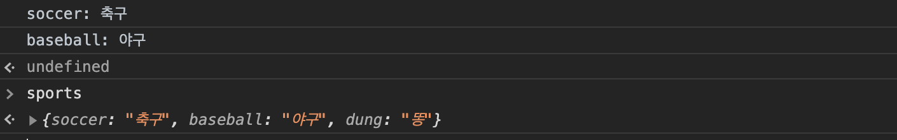
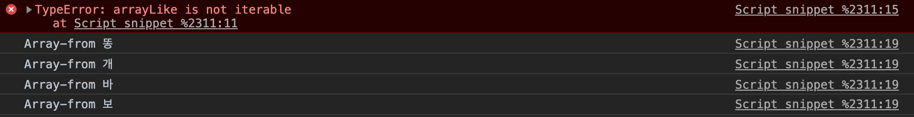
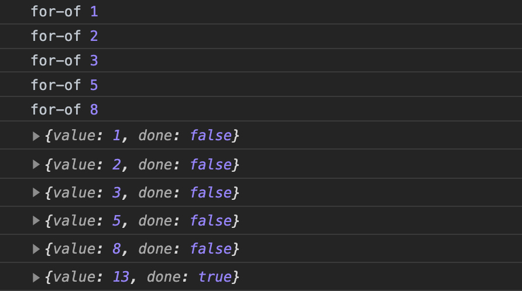

# 이터레이션

- 반복 가능 해야 한다.

- 이터레이션을 위한 프로토콜이 필요하다.
- 프로토콜(규약)

- 이터레이션은 프로토콜을 갖고 있다.
- 프로토콜에 따라서 이터레이션을 수행한다.

- 프로토콜이 구문과 빌트인이 아니므로, 프로토콜에 맞으면 이터레이션 가능

`이터레이션 프로토콜`

- 오브젝트가 반복할 수 있는 구조여야 한다.
- 이터레이션 `[Symbol.iterator]`함수를 갖고 있어야 한다.

`이터레이션 프로토콜 구분`

- 이터러블(iterable) 프로토콜
- 이터레이터(iterator) 프로토콜

- 이터러블은 반복 가능해야 하고
- 이터레이터 프로토콜은 Symbol.iterator 메서드를 갖고 있어야 한다.

```js
const list = [10, 20];

for (let value of list) {
  console.log(value);
}

// [Symbol.iterator] 이터러블 프로토콜 (Symbol.iterator)를 갖고있느냐?
// 이터레이터를 만들어주는 것이 이터러블이라고 생각하면 된다.
const obj = list[Symbol.iterator]();

// 실행하는 iteration Protocol (next 메서드를 갖고 있다.)
console.log(obj.next());
console.log(obj.next());
console.log(obj.next());
```

- 개발자 코드로 프로토콜을 맞추면 이터레이션할 수 없는 오브젝트를 이터레이션할 수 있도록 만들 수 있다.

## 이터러블 프로토콜

- 오브젝트가 반복할 수 있는 구조여야 하고, Symbol.iterator를 갖고 있어야 한다.
- Symbol.iterator를 갖고 있는 빌트인 오브젝트
  - Array, Argument, String, TyedArray, Map, Set, DOM NodeList

### 이터러블 오브젝트

- 이터러블 프로토콜을 갖고 있는 오브젝트 (Symbol.iterator 프로토타입 메서드를 갖고 있는 오브젝트)

```js
const list = [10, 20];
// 갖고 있기 때문에 list는 이터러블 오브젝트라고 한다.
// list[Symbol.iterator] ƒ values() { [native code] }
console.log("list[Symbol.iterator]", list[Symbol.iterator]);

const obj = { one: 10, two: 20 };
// Symbol.iterator가 없다고 나오니 obj는 이터러블 오브젝트라고 볼 수 없다.
// obj[Symbol.iterator] undefined
console.log("obj[Symbol.iterator]", obj[Symbol.iterator]);
```

> [ ] 리터럴로 생성하는 Array는 Symbol.iterator가 있으니, 이터러블 오브젝트라고 할 수 있고,
> { } 리터럴로 생성하는 Object는 Symbol.iterator가 없으니, 이터러블 오브젝트가 아니다.
> for 문의 반복과 이터레이션이 차이가 있듯이, for...in의 열거와 이터레이션은 차이가 있다.
> 열거랑 이터레이션은 다른 개념이라는 것이다.

- 이터러블 오브젝트인 list 변수의 내부를 보자
- Array.prototype을 상속받았는데 Array.prototype에 자체적으로 Symbol.iterator 함수를 갖고있는 것을 볼 수 있다. 결국 호출할 수 있다는 것이다.
  

## 이터레이터 프로토콜

- 값을 순서대로 생성하는 방법

### 이터레이터 오브젝트

- 이터러블 오브젝트에서 Symbol.iterator()를 호출하면 이터레이터 오브젝트가 생성되어 반환된ㄷ.
- 이터레이터 오브젝트에 next()가 이다.
- 생성한 오브젝트를 이터레이터라고도 부른다.

```js
const list = [10, 20];
const iterator = list[Symbol.iterator]();

console.log(iterator.next()); // {value: 10, done: false}
console.log(iterator.next()); // {value: 20, done: false}
console.log(iterator.next()); // {value: undefined, done: true}
```

> iterator의 next메서드를 호출하면 value와 done property를 갖는 이터레이터 리절트 객체를 반환한다.
> done이 true라는 것은 이터레이터의 종료를 의미합니다.

- iterator 변수를 찍어본 결과 이다.
  
- next 메서드를 통해 생성된 객체에 대해서도 한번 보자.
  
  > value와 done을 프로퍼티로 갖고있고, 객체 형식이기에 프로토타입체인에는 Object.prototype이 존재하는것을 볼 수 있다.

## for...of 문

- 이터러블 오브젝트(프로토타입 체인에 Symbol.iterator 메서드를 갖고있는 오브젝트)를 반복

```js
const list = [1, 2, 3];
// 특정 인덱스부터 읽어 드릴 수 있다.
for (let k = 0; k < list.length; k++) {
  console.log(list[k]); // 1, 2, 3
}

// 처음부터 끝까지 읽어드린다 (for...of문) 순회하는 값이 value에 할당되어진다.
for (let value of list) {
  console.log(value); // 1, 2, 3
}

// 이터레블 오브젝트의 Symbol.iterator메서드를 호출하여 반환한 이터레이터 오브젝트는 예외가 발생한다.
const iter = list[Symbol.iterator]();

debugger;
iter.next(); // 한번 next메서드를 호출했으니 2,3만 남은 것이다.

// 이터레이터 오브젝트를 넣을때는 항상 미리 생각하고 넣자. 이터러블 오브젝트를 넣으면 그냥 처음부터 순회해준다.
for (let value of iter) {
  console.log(value); // 2, 3 따라서 2,3만 나온다.
}
```

- 이터레이터는 이터러블 프로토콜을 준수하면서, next메서드를 갖는다 자 한번 보자
  
  > 보면 이터레이터 역시도 Symbol.iterator를 프로토타입 체인안에 가지고 있다. 그래서 이터레이터 오브젝트 역시도 이터러블 프로토콜을 준수하고 있기에 for...of문을 사용할 수 있는 것이다.

### for...in, for...of 차이

- for...in
- 열거 가능한 프로퍼티가 대상이다.

```js
const obj = {};
Object.defineProperties(obj, {
  sports: {
    // 원래 default가 false이지만... 설명을 위해 넣어본다.
    enumarable: false,
    value: "스포츠",
  },
  book: {
    // enumarable을 true로 지정하면 열거 가능한 상태가 된다.
    enumerable: true,
    value: "책",
  },
  dung: {
    enumerable: true,
    value: "똥",
  },
});

for (let key in obj) {
  // book: 책
  // dung: 똥
  console.log(key + ": " + obj[key]);
}
```

- for...of
- 이터러블 오브젝트가 대상
- 위 예제에서 보여준 Object는 이터러블 오브젝트가 아니라서 for...of를 사용할 수 없다.
- for...of를 사용해서 오브젝트를 사용하는 방법은 Object.keys를 사용하여 키값들을 value로 갖는 이터러블 오브젝트를 반환받아 순회하면 된다.

```js
const sports = {
  soccer: "축구",
  baseball: "야구",
  dung: "똥",
};

Object.defineProperties(sports, {
  dung: { enumerable: false },
});

const keyList = Object.keys(sports);

for (let key of keyList) {
  console.log(key + ": " + sports[key]);
}
```

- Object.keys 역시도 열거가능하지 않은 것에 대해서는 순회하지 않습니다.
  

### 이터러블과 유사 배열 객체

- 위에서 설명한대로 Object는 순회가 불가능하다. 하지만 Object.keys를 사용하지 않고도 또 Array.from 이라는 Array 표준 빌트인 생성자함수의 static 메서드인 from을 사용해서 Array-like object를 인수로 전달하면 이터러블 오브젝트로 반환해준다.
- 설명에 앞서 Array-like 오브젝트를 한번 보자.
- Array-like 오브젝트의 특징으로는 뱌욜초롬 0에서 출발하는 index를 프로퍼티키로 가져야한다. 그리고 length 프로퍼티를 가져야 한다.

```js
const arrayLike = {
  0: "똥",
  1: "개",
  2: "바",
  3: "보",
  length: 4,
};

// arrayLike는 이터러블 오브젝트가 아니기에 에러가 난다.
try {
  for (const item of arrayLike) {
    console.log(item);
  }
} catch (e) {
  console.error(e);
}

for (const item of Array.from(arrayLike)) {
  console.log("Array-from", item);
}
```



> Array.from을 통해서 array-like object를 이터러블 오브젝트로 만들어줬기에 순회가 가능한 것을 볼 수 있다.
> Array.from 메서드는 배열 형식으로 반환해주는데, Array타입 오브젝트는 프로토타입 체인에 Symbol.iterator를 메서드로 갖기 때문에 이터러블 오브젝트인셈이다.

### 이터레이션 프로토콜의 필요성

- for...of문, 스프레드 문법, 배열 비구조화 할당 등은 Array, String, Map,Set, TypedArray, DOM 컬렉션(NodeList, HTMLCollection), arguments와 같이 다양한 데이터 소스를 사용할 수 있다.

- Array, String, Map,Set, TypedArray, DOM 컬렉션(NodeList, HTMLCollection), arguments 의 공통 점은 모두 이터레이션 프로토콜을 준수하는 이터러블 이다.(Symbol.iterator를 프로토타입체인에서 갖고 있습니다.) - 데이터 공급자 역할

- for...of, 스프레드 문법, 배열 비구조화 할당, Map, Set의 생성자는 이터러블을 받아서 데이터를 소비하는 데이터 소비자 역할
- 이터레이션 프로토콜이 이 중간에서 데이터 소비자와 데이터 공급자를 연결하는 인터페이스의 역할을 한다.

### 사용자 정의 이터러블

- 위에서 설명한 대로 일반 객체 역시도 이터레이션 프로토콜을 준수하도록 구현하면 이터러블이 될 수 있다.
- 이터러블의 조건이 무엇이었는지 다시 한번 생각해보자.
- Symbol.iterator메서드를 갖고 있어야 하고(이터러블 프로토콜), 부가적으로 Symbol.iterator 메서드를 호출하면 next메서드를 갖는 객체를 반환해주고, next() 메서드를 호출시에 value와 done을 프로퍼티로 갖는 이터레이터 리절트 객체를 반환해주는 조건(이터레이터 프로토콜)

#### `사용자 정의 이터러블 구현`

```js
const fibonacci = {
  [Symbol.iterator]() {
    let [pre, cur] = [0, 1]; // 배열 비구조화 할당을 이용하여, pre에 0, cur에 1을 할당 (배열 비구조화 할당을 사용할 수 있는 이유는 [0,1]은 [] 리터럴을 이용하여 생성한 Array고 Array.prototype에는 Symbol.iterator를 갖고 있기 때문이다.)

    const max = 10; // 수열의 최대 값

    // Symbol.iterator 메서드는 next 메서드를 소유한 이터레이터 오브젝트를 반환해야 하고 next 메서드를 호출시에는 value, done을 프로퍼티로 갖는 이터레이터 리절트 객체를 반환해야 한다.
    return {
      // es6 축약형 메서드로 next메서드 생성 (축약형 메서드는 non-constructor이기에 생성자함수로는 사용불가)
      next() {
        [pre, cur] = [cur, pre + cur]; // 기존에 pre에는 현재 cur에 들어있는 값 할당, cur에는 기존 pre와 기존 cur값을 더한 것을 할당해준다. 피보나치 수열 자체가 현재 값과 그 이전 값을 더하여 수열을 생성해 내기 때문이다.

        return { value: cur, done: cur >= max }; // max 보다 pre + cur이 커지게되면 종료된다는 것을 의미한다.
      },
    };
  },
};
// 이제 이터레이션 프로토콜을 준수하여 생성하였기 때문에, fibonacci는 이터레이션 프로토콜을 준수하게 되었다. 이제 for...of문을 통해서 순회가 가능해졌으니, 돌려보자.

for (const num of fibonacci) {
  console.log("for-of", num);
}

const iterator = fibonacci[Symbol.iterator]();

// Symbol.iterator를 직접 호출 하여 이터레이터를 반환한 후 next메서드를 사용해서 이터레이터 리절트 객체를 찍어보자.
console.log(iterator.next());
console.log(iterator.next());
console.log(iterator.next());
console.log(iterator.next());
console.log(iterator.next());
console.log(iterator.next());

const arr = [...fibonacci]; // 위에서 설명한대로 iteration 프로토콜을 준수한 이터러블 객체는 배열 스프레드 오퍼레이터를 사용할 수 있다.
console.log(arr); // [1,2,3,5,8]

const [first, second, ...rest] = fibonacci;
console.log(first, second, rest); // 1 2 [3, 5, 8]
```



- 13이 value로 나오는 시점에는 이미 done이 true로 나오기에 for...of는 종료되어 출력되지 않는 것이다.

#### `사용자 정의 이터러블을 생성하는 함수 구현`

- 위에서는 max값을 직접 갖고 있지만, 인수를 전달받아 해당하는 함수가 나오기 전까지 피보나치 수열을 반환해주는 함수를 구현해보자.
- max값을 20으로 호출해본다.

```js
const fibonacciFunc = function (max) {
  let [pre, cur] = [0, 1];

  return {
    [Symbol.iterator]() {
      return {
        next() {
          [pre, cur] = [cur, pre + cur];
          return { value: cur, done: cur >= max };
        },
      };
    },
  };
};

for (const num of fibonacciFunc(20)) {
  console.log(num); // 1,2,3,5,8,13
}

const arr = [...fibonacciFunc(20)];
console.log(arr); // [1, 2, 3, 5, 8, 13]

const [first, second, ...rest] = fibonacciFunc(20);
console.log(first, second, rest); // 1 2 (4) [3, 5, 8, 13
```

> 위에 예제와 달라진점은 이제 max값을 오브젝트에 정적으로 넣어줄 필요없이 매개변수로 전달받아서 처리할 수 있어, 확장성이 더 올라간것 같다.

- 지금까지는 결국 함수를 통해서 반환된 것은 이터러블 오브젝트에 불과하였고, 이터러블 오브젝트는 `[Symbol.iterator]`를 갖고 있어 해당 메서드를 호출하여 이터레이터를 반환받았는데, 이터러블이면서 동시에 이터레이터인 객체나 함수를 어떻게 생성할 수 있을까?

`before` - 위에 fibonacci 사용자 정의 이터러블을 사용했을 경우 이터레이터 생성방법

```js
const iterator = fibonacci[Symbol.iterator]();

// Symbol.iterator를 직접 호출 하여 이터레이터를 반환한 후 next메서드를 사용해서 이터레이터 리절트 객체를 찍어보자.
console.log(iterator.next());
console.log(iterator.next());
console.log(iterator.next());
console.log(iterator.next());
console.log(iterator.next());
console.log(iterator.next());
```

`after`

- 사용자 정의 이터러블 이면서 이터레이터 프로토콜

```js
const fibonacci = {
  pre: 0,
  cur: 1,
  max: 10,
  [Symbol.iterator]() {
    return this;
  },
  next() {
    this.cur = this.pre + this.cur;
    this.pre = this.cur;

    return { value: this.cur, done: this.cur >= this.max };
  },
};

console.log(fibonacci.next());
console.log(fibonacci.next());
console.log(fibonacci.next());
console.log(fibonacci.next());
console.log(fibonacci.next());
```

- 사용자 정의 이터러블이면서 이터레이터를 생성하는 함수

```js
const fibonacciFunc = (max) => {
  let [pre, cur] = [0, 1];

  return {
    [Symbol.iterator]() {
      return this;
    },
    next() {
      [pre, cur] = [cur, pre + cur];

      return { value: cur, done: cur >= max };
    },
  };
};

const iter = fibonacciFunc(10);
console.log(iter.next());
console.log(iter.next());
console.log(iter.next());
console.log(iter.next());
console.log(iter.next());
```

### 4.무한 이터러블과 지연 평가

- 무한 수열을 구현해보자!

```js
const fibonacciFunc = function () {
  let [pre, cur] = [0, 1];

  return {
    [Symbol.iterator]() {
      return this;
    },
    next() {
      [pre, cur] = [cur, pre + cur];
      // 무한을 구현할 때는 done프로퍼티를 생략해준다. done이 트루면 종료되기 때문에
      return { value: cur };
    },
  };
};

for (const num of fibonacciFunc()) {
  if (num > 10000) break;
  console.log(num); // 1 2 3 5 8 ...4181 6765
}

const [f1, f2, f3] = fibonacciFunc();
console.log(f1, f2, f3); // 1 2 3
```

- 데이터가 필요한 시점에 평가하는 것을 `지연평가`라고 한다. next메서드가 호출될때에만 평가가 된다. for of를 순회하면서 넥스트 메서드를 호출해주는데 10000이 넘어가면 break를 걸어서 반복문을 빠져나오기에 10000이 넘는 수는 출력되지 않는 것이다.

- 지연 평가 사용시 미리 불필요한 데이터 생성하지 않, 필요한 순간에만 가져올 수 있어 불필요한 메모리를 소비하지 않아도된다는 장점이 존재한다.
